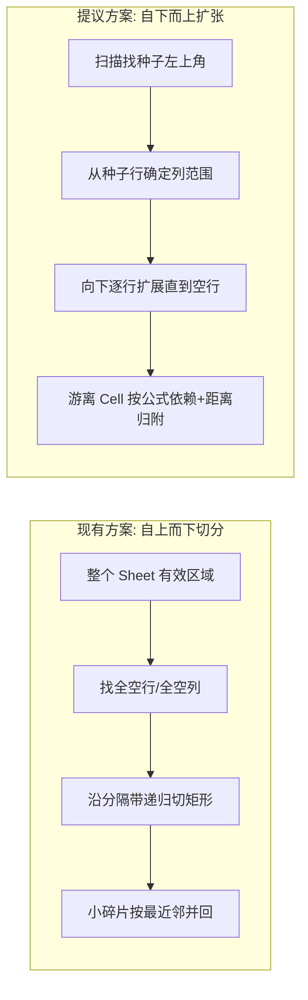

# Excel 单 Sheet 多表分割：种子扩张方案可行性分析

## 1. 两种方案核心思路对比



- **现有方案**：在全局有效范围里找"整行或整列全部为空"的分隔带，沿分隔带递归切割成矩形子区域
- **提议方案**：逐个找到尚未归属的非空 cell 作为种子，从该 cell 所在行向右确定列范围，然后在该列范围内向下扫描直到碰到全空行，形成一个区域；重复直到所有非空 cell 都被覆盖；最后把零散 cell 按公式依赖或距离归附

## 2. 关键场景对比

**场景 A：对角错位排列（现有方案的已知弱点）**

```
  A  B  C  D
1 x  x
2 x  x
3       x  x
4       x  x
```

- 现有方案：找不到全空行（row 3 有 C3/D3）也找不到全空列（col B 有值，col C 有值）→ 整块当一张表。**切不开**
- 种子扩张：seed A1 → 列范围 A-B → row 3 在 A-B 范围全空 → region A1:B2；seed C3 → 列范围 C-D → region C3:D4。**正确切分**

**场景 B：垂直排列，中间有空行（两者都能处理）**

```
  A  B  C
1 x  x  x
2 x  x  x
3
4 x  x  x
5 x  x  x
```

两种方案都能正确切分，行为一致。

**场景 C：共享表头行（两者都切不开）**

```
  A  B  C  D  E
1 x  x  x  x  x   ← 共享宽表头
2 x  x
3          x  x
```

- 种子扩张：seed A1 → 列范围 A-E（整行非空）→ row 2/3 在 A-E 范围内都不是全空 → 整块一个区域
- 现有方案：同样切不开
- **结论：共享表头是两种方案的共同盲区**，这不是退步

**场景 D：表格间只有部分空列分隔**

```
  A  B     D  E
1 x  x     x  x
2 x  x     x  x
```

- 现有方案：col C 全空 → 按列切。OK
- 种子扩张：seed A1 → 列范围 A-B（C1 空则停）→ region A1:B2；seed D1 → region D1:E2。OK
- 行为一致

**场景 E：第一行比表体窄（种子扩张的弱点）**

```
  A  B  C  D
1    x  x         ← 窄表头（合并标题等）
2 x  x  x  x     ← 实际数据比表头宽
3 x  x  x  x
```

- 种子扩张：seed B1 → 列范围 B-C → row 2 在 B-C 有值 → 继续。但 A2/D2 不在范围内，会变成游离 cell
- 现有方案：有效区域 A1:D3，无分隔带 → 整块处理。虽然没切，但至少没丢数据
- **种子扩张在此场景下需要额外处理**（见下方优化建议）

## 3. 技术可行性

### 3.1 "能不能直接找到表格左上角"

**可以，但有条件。** openpyxl 的 `ws.tables` 能读取 Excel 中用户通过"插入→表格"创建的正式 Table 对象：

```python
for table in ws.tables.values():
    print(table.displayName, table.ref)  # e.g. "Table1", "A1:E5"
```

但现实是：**大多数"乱贴"场景里用户并没有用 Excel 的正式 Table 功能**，只是在不同位置粘贴了数据。此时 `ws.tables` 为空。

**结论**：可以优先读 `ws.tables` 作为已知区域，但主逻辑仍需要"扫描发现种子"的兜底路径。

### 3.2 公式依赖解析

当前代码用 `data_only=True` 加载工作簿（获取计算后的值，丢失公式文本）。要解析公式依赖，需要：

- **额外一次 `data_only=False` 加载**：获取公式字符串
- **用 `openpyxl.formula.Tokenizer`** 提取 RANGE 类型 token

```python
from openpyxl.formula import Tokenizer
tok = Tokenizer("=SUM(A1:A10)")
refs = [t.value for t in tok.items if t.subtype == 'RANGE']
# → ['A1:A10']
```

**代价**：
- 额外一次 workbook 加载 → 内存翻倍
- 只有含公式的 cell 才有依赖信息；纯值 cell 无法参与公式图
- `.xls` 转换后公式可能丢失

**结论**：公式依赖可做，但作为 Phase 2 优化更稳妥。Phase 1 先用纯距离归附。

### 3.3 合并单元格处理

与现有方案一样需要处理。种子扩张时需要：
- 合并区域内的 cell 视为非空（避免误判为空行/空列）
- 种子发现时跳过已被合并区域覆盖的从属 cell

这部分逻辑可以从现有的 `_is_true_separator_row/col` 中复用。

## 4. 综合对比

- **核心方向**：现有是 "全局找分隔 → 切开"；提议是 "找种子 → 局部长出区域"
- **对角/错位布局**：提议方案严格优于现有方案（现有完全失败的场景，提议能正确处理）
- **紧贴/共享表头**：两者都切不开，打平
- **第一行窄于表体**：提议方案有列范围偏小风险，需要补偿机制（如：用前 N 行取并集确定列范围）
- **计算量**：提议方案需全表扫描标记已访问 cell + 每个种子做区域增长，复杂度相近
- **公式依赖**：是增量优势，但需双次加载 workbook，建议分 Phase
- **碎片合并**：现有用 `min_cells=4` 阈值；提议用"游离 cell 归附"，语义更清晰
- **可测试性**：种子扩张的行为更可预测（给定种子位置 → 确定性区域），比递归切分更容易写断言
- **向后兼容**：需要验证现有能正确处理的 case 不退步

## 5. 建议的算法细节

### Phase 1：种子发现 + 区域扩张

```
visited = set()

1. 如果 ws.tables 非空，先把 defined Table 的区域标记为 visited，直接作为已知 region
2. 从 (1,1) 开始，按行优先顺序扫描整个 sheet
3. 找到第一个 未 visited 且非空的 cell → 作为种子 (seed_row, seed_col)
4. 从 seed 确定列范围：
   - 向右扫描 seed_row，包含连续非空 cell（合并区域内视为非空）
   - 额外检查 seed_row+1 ~ seed_row+2 的列范围，取并集 → 得到 col_range
   - （这个"多行取并集"是对"第一行偏窄"场景的补偿）
5. 在 col_range 内向下逐行扫描：
   - 行内至少一个 cell 非空（合并区域内视为非空）→ 包含该行
   - 遇到行内全空 → 停止
6. 得到一个 region (row_range, col_range)，标记为 visited
7. 回到步骤 2，直到无新种子
```

### Phase 2：游离 Cell 归附

```
1. 扫描全表，找到所有未被任何 region 覆盖的非空 cell
2. 对每个游离 cell：
   a. [可选] 解析公式引用 → 如果引用落在某个 region 内 → 归附
   b. 否则按 bounding box 距离归附到最近 region
3. 归附后扩展目标 region 的 bounding box
```

### Phase 3：向后兼容保护

- 对现有能正确处理的典型 case（垂直分隔、水平分隔、合并标题保护），确保新算法不退步
- 保留 precision mode / legacy mode 回退机制

## 6. 实现范围建议

### Phase 1（核心替换，建议先做）
- 替换 `_split_sheet_recursive` + `_merge_small_subtables` 为种子扩张算法
- 复用现有的合并单元格保护逻辑
- 游离 cell 按纯距离归附
- 保留 `ws.tables` 作为优先信号

### Phase 2（增量优化，后续迭代）
- 双次加载 workbook，构建公式依赖图
- 游离 cell 优先按公式依赖归附，距离作为 fallback
- 与 `TASKS.md` 中 "Excel 子表公式依赖合并 (Phase 2)" 对齐

## 7. 涉及文件

- [table_parser.py](apps/worker/app/services/document_parser/table_parser.py) — 替换 L525-697 的 `_split_sheet_recursive` + `_merge_small_subtables` + `_find_effective_range` + `_is_true_separator_row/col` + `_find_separator_groups`，新增种子扩张函数
- [table_parser.py L756-789](apps/worker/app/services/document_parser/table_parser.py) — `parse_headers_from_excel` 中调用新算法替换旧调用
- 测试：新增针对"对角错位、垂直分隔、水平分隔、共享表头、窄首行"等场景的单元测试
