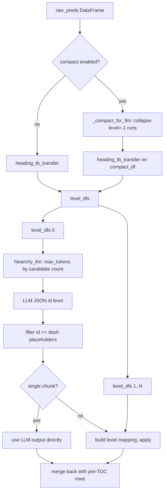

# Hierarchy LLM 输入压缩方案

## 1. 背景与目标

当前 [apps/worker/app/services/document_parser/layout_parser.py](apps/worker/app/services/document_parser/layout_parser.py) 中 `est_hierarchies_llm` / `hiearchy_llm` 把 `raw_preds` 的全部行（含 `level=-1` 的 body、Figure/Image）一并渲染成 padded markdown 表格送给 LLM。实测样本 `EN_Atlas Technical Handbook`（274 行，其中 232 行 `level=-1`）一次调用 **~10,214 input tokens**，其中约 **85% 花在 body 行上**。

优化目标：
- 把连续 `level=-1` 的行折叠成一个占位符，保留"这里有 N 行正文"的位置语义，去掉逐字正文。
- 重写 `hiearchy_llm` 的 `max_tokens` 估算，从按输入字符数 ×1.2 改为按 heading 候选数估。
- 增加环境变量开关以便 A/B。
- 不改 zone-based 多 TOC 调度、不改 mapping 逻辑本身（但压缩后单 chunk 覆盖率大幅上升，mapping 分支实际调用会接近 0）。

## 2. 真实样本收益

- `texts` token：7,471 → 1,307（-82%）
- 整 prompt：10,214 → 4,050（-60%）
- output `max_tokens`：8,192 cap → ~1,250（实际 JSON 输出 ~505 tokens）
- 单次成本（GPT-4o 参考价）：$0.031 → $0.013

## 3. 数据流示意



## 4. 具体改动

### 4.1 `layout_parser.py` — 新增 compaction 工具函数

位置：[apps/worker/app/services/document_parser/layout_parser.py](apps/worker/app/services/document_parser/layout_parser.py)，放在 `heading_tb_transfer` 之前。

```python
def _compact_for_llm(df: pd.DataFrame) -> pd.DataFrame:
    """Collapse consecutive level == -1 runs into one placeholder row.

    Keeps rows with level >= 1 (headings) and level == -2 (Not Sure) verbatim.
    Placeholder row uses id = 'start-end', heading = '[N BODY LINES]', level = '-'.
    """
    rows = []
    i, n = 0, len(df)
    while i < n:
        lvl = df.iloc[i]["level"]
        if isinstance(lvl, (int, float)) and int(lvl) == -1:
            j = i
            while j < n and int(df.iloc[j]["level"]) == -1:
                j += 1
            start_id = int(df.iloc[i]["id"])
            end_id = int(df.iloc[j - 1]["id"])
            run = j - i
            rows.append({
                "id": f"{start_id}-{end_id}" if start_id != end_id else f"{start_id}",
                "heading": f"[{run} BODY LINES]",
                "level": "-",
                "reason": "__PLACEHOLDER__",
            })
            i = j
        else:
            r = df.iloc[i]
            rows.append({
                "id": int(r["id"]),
                "heading": str(r["heading"]),
                "level": int(r["level"]) if int(r["level"]) != -2 else "Not Sure",
                "reason": str(r.get("reason", "")),
            })
            i += 1
    return pd.DataFrame(rows, columns=["id", "heading", "level", "reason"])
```

要点：
- run 长度 ≥ 1 都折叠（包括单独一行）。
- id 用 `start-end` 范围，单行时省略成 `start`。
- level=-2 ("Not Sure") 不折叠，renderer 里输出字面量 "Not Sure" 以匹配 prompt 描述（现行逻辑里 -2 也会渲染为 "Not Sure"）。
- 保留 `reason` 列是为了保留后续 `build_level_mapping` 的 mapping key（多 chunk 分支需要，但占位符行用 `__PLACEHOLDER__` 标记方便过滤）。

### 4.2 `est_hierarchies_llm` — 在切 chunk 前做压缩

位置：[apps/worker/app/services/document_parser/layout_parser.py](apps/worker/app/services/document_parser/layout_parser.py) L1303-1423。

```python
def est_hierarchies_llm(raw_preds, prompt_limt, toc_hierarchies=None, max_len=30, max_depth=6, model_name=None, output_dir=None, csv_suffix=""):
    ...
    compact_enabled = os.environ.get("KB_LAYOUT_LLM_COMPACT_INPUT", "true").lower() in ("true", "1")
    preds_for_llm = _compact_for_llm(raw_preds) if compact_enabled else raw_preds

    level_dfs, raw_headings = heading_tb_transfer(preds_for_llm, threshold=prompt_limt, max_start=max_len, max_end=5)
    ...
```

`raw_headings` 在后面只用于 single-chunk 的 `full_preds['heading'] = raw_headings` 回填——这一步需要改成只对非占位符行回填原 heading，或者完全跳过（因为 `_compact_for_llm` 保存的就是 compact heading，需要 merge 回原始 raw_preds）。详细做法：

- `hiearchy_llm` 返回结果是 `[{"id":..., "level":...}]`，其中 id 对 heading 候选来说是整数、对占位符是 `start-end` 字符串。
- 在 `est_hierarchies_llm` 收到 `layout_res` 后，先过滤掉 id 不是整数的条目（占位符 / LLM 误回 body）。
- 然后把 `{id_int: level}` 映射应用回**原始** `raw_preds`：heading 候选行取 LLM 给的 level；其余 id（含 body、占位符聚合的 id 范围）全部 `level = -1`。这样 `pre_toc_rows` 拼回、`heading_preds` 原 id 对齐都不会破。

调整后的 single-chunk 伪代码：

```python
if len(level_dfs) == 1:
    logger.info("single chunk — skipping reason-code mapping, using LLM output directly")
    llm_levels = {item["id"]: item["level"] for item in layout_res if isinstance(item["id"], int)}
    full_preds = raw_preds.copy()
    full_preds["level"] = full_preds["id"].map(lambda rid: llm_levels.get(int(rid), -1)).astype(int)
    full_preds = full_preds[["id", "heading", "level", "reason"]]
```

multi-chunk 分支保留现行 mapping 逻辑，但 mapping 的 key 仍是 `reason`；需要在 `build_level_mapping` 之前把占位符行（`reason == "__PLACEHOLDER__"`）剔除。

### 4.3 `hiearchy_llm` — 修 max_tokens 估算

位置：[apps/worker/app/services/document_parser/layout_parser.py](apps/worker/app/services/document_parser/layout_parser.py) L966-992。

```python
def hiearchy_llm(df, model_name=None, max_depth=6, toc_context=None, max_len=2048, task="eval-headings"):
    level_md = df2md(df)

    n_candidates = int((df["level"].astype(str) != "-").sum())
    ot_limit = max(512, n_candidates * 25 + 200)
    ot_limit = min(ot_limit, max_len)

    ...
    # After eval_response:
    layout_res = [it for it in layout_res if isinstance(it.get("id"), int)]
    ...
```

要点：
- 默认 `max_len` 从 8192 降到 2048，仍远超实际需要。
- `n_candidates` 用占位符行过滤后的候选数，估 JSON 输出约 25 tokens/条 + 200 tokens overhead，下限 512。
- 过滤 LLM 误返的占位符 id。

### 4.4 `prompt_service.py` — 更新 `eval-headings` 模板

位置：[packages/shared-python/shared/services/ai/prompt_service.py](packages/shared-python/shared/services/ai/prompt_service.py) L110-229。

在"Data to be adjusted"段落后、STEP 1 前，插入一段占位符说明：

```
***Placeholder Rows***
Some rows may appear as "[N BODY LINES]" with id in the form "start-end". These represent N
consecutive body-text lines that have been collapsed to save space. Treat them as context
markers only — they preserve the positional gap between adjacent heading candidates.
You MUST NOT include any placeholder row in your output (never emit id containing '-').
Only evaluate rows whose id is a single integer.
```

Rule 0（Figure/Image）保留不动——因为折叠后它们被吸进占位符了，Rule 0 实际变成"没出现就默认 -1"的兜底。

### 4.5 中间 CSV（`preds_3_llm_base{csv_suffix}.csv`）

保持现状：`base_preds` 在 `est_hierarchies_llm` 里仍基于 compact 版本 `basic_df`（level_dfs[0]）保存——这正是 compact_df 的 chunk 0，能直观看到 LLM 看到了什么。`preds_4_llm_final` 依旧保存最终映射结果（整张表，未压缩）。不需要新增文件。

### 4.6 开关

新增环境变量 `KB_LAYOUT_LLM_COMPACT_INPUT`，默认 `true`。位于 `os.environ.get("KB_LAYOUT_LLM_COMPACT_INPUT", "true")`。关掉即退回原有行为便于回归对比。

## 5. 测试 / 验证

- 单测：在 [apps/worker/tests/test_layout_parser.py](apps/worker/tests/test_layout_parser.py) 增加
  - `_compact_for_llm` 基本行为（run 折叠、id 范围、单行 run、全 -1、全 heading、level=-2 不折）。
  - `hiearchy_llm` `max_tokens` 估算边界（0 candidates, 大候选数触顶）。
  - LLM 返回含占位符 id 时被正确过滤。
- 集成：对现有 `.knowhere/chengke_kb/` 下已有解析文档跑一轮 compact vs non-compact，对比：
  - 最终 `preds_5_final_output.csv` 的 heading 总数 / level 分布差异。
  - `heading.hierarchy_llm_call` stage_timer 的 prompt tokens 统计（已接 `stage_profiler`）。
  - zone-based 文档（多 TOC）与 DOCX 路径各至少一个样本。
- 手动 spot check：挑 2-3 个中文 docx、1 个英文 pdf，观察是否出现 heading 漏判。

## 6. 风险与回退

- 风险：占位符行 id 含 `-`，若 LLM 未忽略，需靠 4.3 的过滤兜底。
- 风险：`_compact_for_llm` 丢了 body 行的 reason 细节，对 multi-chunk 的 mapping 精度略有折损——但压缩后多 chunk 几乎不触发，且原流程里 chunk 0 的 reason mapping 本身就被注释标记为 lossy。
- 回退：`KB_LAYOUT_LLM_COMPACT_INPUT=false` 立即恢复原行为。
- 不影响：`pred_titles` 的 pre-TOC 剔除、zone-based 调度、docx 的 postprocess（`merge_continuous` / `merge_short` / `judge_negs`）都在 compaction 前后两端，互不干扰。
