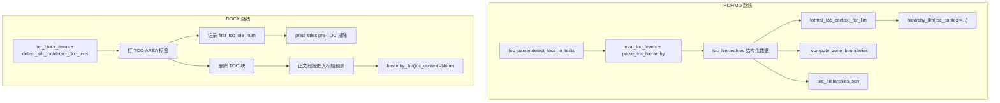

# TOC 在 PDF/MD 与 DOCX 两条路线的对比分析

## 核心结论

**DOCX 路线在 TOC 识别后仅做了"删除 + 定位"，丢弃了 TOC 条目本身的层级信息；PDF/MD 路线则把 TOC 条目解析成结构化的层级树，并作为上下文注入 LLM 标题预测。两者存在明显的能力断层。**

---

## 当前两条路线的完整对比

### 1. TOC 识别阶段

| 维度 | PDF/MD 路线 | DOCX 路线 |
|------|-------------|-----------|
| 入口 | `toc_parser.detect_tocs_in_texts(md_lines)` | `doc_parser.iter_block_items` 中逐块调用 `toc_parser` 的三个函数 |
| 识别方式 | 关键词候选 + LLM 判定范围 (`detect-toc-range`) | XML 结构识别：SDT 容器 / `w:pStyle` 含 "toc" / `w:instrText` TOC 域 |
| 准确度 | 需要 LLM 辅助，但覆盖面广 | 基于 OOXML 结构，对标准 Word 文档非常准确 |
| 输出标签 | 不打标签，直接按行号范围切除 | 每个段落打 `TOC-AREA` 标签 |

**结论：识别阶段两边都完成得不错，但产物形式不同。**

### 2. TOC 信息提取与结构化（关键差异点）

| 维度 | PDF/MD 路线 | DOCX 路线 |
|------|-------------|-----------|
| 条目层级解析 | `eval_toc_levels` -> `parse_toc_hierarchy` -> `hiearchy_llm(task="eval-toc-headings")` | **没有** |
| 输出数据结构 | `toc_hierarchies` 列表，每项含 `toc_range`, `toc_with_level`, `toc_tree` | 仅 `first_toc_ele_num`（一个整数） |
| 持久化 | 写入 `toc_hierarchies.json` | **无** |
| 可用信息量 | 完整的目录条目文本 + 层级编号 + 嵌套树 | 只知道 TOC 区域的起始位置 |

**这是最大的断层：DOCX 实际上拥有比 PDF 更精确的 TOC 条目信息（Word 的 TOC 样式自带层级 `TOC1`/`TOC2`/...），但当前代码完全丢弃了这些信息。**

### 3. TOC 在标题预测中的应用

| 维度 | PDF/MD 路线 | DOCX 路线 |
|------|-------------|-----------|
| Pre-TOC 封面排除 | 基于 `toc_hierarchies[0]["toc_range"][0]` | 基于 `first_toc_ele_num` |
| LLM 层级预测上下文 | `format_toc_context_for_llm(toc_hierarchies)` 注入 prompt 的 `toc_context` | **无** — `toc_hierarchies=None`，LLM 看不到目录结构 |
| 多 TOC 分区处理 | `_compute_zone_boundaries` + 每区独立 LLM 预测 | **不支持** |
| 效果 | LLM 有目录参照，层级预测更准确 | LLM 缺乏目录参照，纯靠正文语义推断层级 |

### 4. 具体代码位置

PDF/MD 路线（`pred_titles` 中 md 分支）：

```1107:1116:apps/worker/app/services/document_parser/layout_parser.py
    if toc_hierarchies and doc_type == "md":
        first_toc_start = toc_hierarchies[0].get("toc_range", (0, 0))[0]
        if first_toc_start > 0:
            pre_toc_mask = raw_preds['id'] < first_toc_start
            if pre_toc_mask.any():
                pre_toc_rows = raw_preds[pre_toc_mask].copy()
                pre_toc_rows['level'] = -1
                raw_preds = raw_preds[~pre_toc_mask].reset_index(drop=True)
                logger.info(f"Excluded {len(pre_toc_rows)} pre-TOC lines "
                            f"(id < {first_toc_start}) from heading prediction")
```

DOCX 路线（`pred_titles` 中 docx 分支）：

```1117:1125:apps/worker/app/services/document_parser/layout_parser.py
    elif first_toc_ele_num is not None and doc_type == "docx":
        if first_toc_ele_num > 0:
            pre_toc_mask = raw_preds['id'] < first_toc_ele_num
            if pre_toc_mask.any():
                pre_toc_rows = raw_preds[pre_toc_mask].copy()
                pre_toc_rows['level'] = -1
                raw_preds = raw_preds[~pre_toc_mask].reset_index(drop=True)
                logger.info(f"Excluded {len(pre_toc_rows)} pre-TOC blocks "
                            f"(ele_num < {first_toc_ele_num}) from heading prediction")
```

`est_hierarchies_llm` 调用时 DOCX 的 `toc_hierarchies` 为 `None`：

```1187:1191:apps/worker/app/services/document_parser/layout_parser.py
        heading_preds = est_hierarchies_naive(raw_preds, smart_parse, output_dir=output_dir)
        if smart_parse:
            heading_preds = est_hierarchies_llm(heading_preds, prompt_limt, toc_hierarchies, model_name=model_name, output_dir=output_dir)
            # 此处 toc_hierarchies 对 DOCX 永远是 None
```

---

## 差异根因分析



**根因：** `doc_parser.py` 在遍历 TOC 块时，只判断了"是不是 TOC"（打标签 -> 删除），**没有提取 TOC 条目的文本和层级**。但 Word 的 TOC 样式（`TOC1`, `TOC2`, ...）本身包含了层级信息，比 PDF 的纯文本行更容易准确解析。

---

## DOCX 实际可利用但未利用的信息

在 `iter_block_items` 遍历 TOC-AREA 段落时，以下信息已经在 XML 中，但被丢弃了：

1. **段落文本** (`text`) — 目录条目标题
2. **TOC 样式级别** — `w:pStyle` 值如 `TOC1`, `TOC2`, `TOC3`，数字直接对应层级
3. **段落缩进** — 可辅助判断层级
4. **Tab 后的页码** — 可用于验证条目是否真实

当前代码虽然 `yield` 了 `(ele_num, text, 'TOC-AREA', None)`，但 `parse_docx` 在第 476 行直接把所有 `"TOC" in label` 的块全部丢弃了。

---

## 对齐方案建议

如果要让 DOCX 路线与 PDF/MD 路线在 TOC 应用层面对齐，核心工作是：

### 方案：从 DOCX TOC 块中提取 `toc_hierarchies` 并传入 `pred_titles`

1. **在 `iter_block_items` 中增强 TOC-AREA 块的元数据**：从 `w:pStyle` 中解析出 TOC 层级（`TOC1`->1, `TOC2`->2），作为 meta 返回
2. **在 `parse_docx` 中，删除 TOC 块前先收集其内容**：构建与 MD 路线兼容的 `toc_hierarchies` 结构（含 `toc_range`, `toc_with_level`, `toc_tree`）
3. **将 `toc_hierarchies` 传入 `pred_titles`**：让 DOCX 也走 `est_hierarchies_llm(..., toc_hierarchies=...)` 路径
4. **可选：写入 `toc_hierarchies.json`** 以保持产物一致性

这个方案的优势是：DOCX 的 TOC 样式天然带层级，**不需要 LLM 来做 `eval-toc-headings`**，反而比 PDF 路线更准确更快。

### 需要改动的文件

- [doc_parser.py](apps/worker/app/services/document_parser/doc_parser.py) — `iter_block_items` 增加 TOC 层级元数据；`parse_docx` 构建 `toc_hierarchies`
- [toc_parser.py](apps/worker/app/services/document_parser/toc_parser.py) — 可选：添加 `build_docx_toc_hierarchies()` 工具函数
- [layout_parser.py](apps/worker/app/services/document_parser/layout_parser.py) — `pred_titles` 中让 DOCX 也接受 `toc_hierarchies` 参数（当前逻辑已有框架，只需放宽 `doc_type == "md"` 的条件判断）
