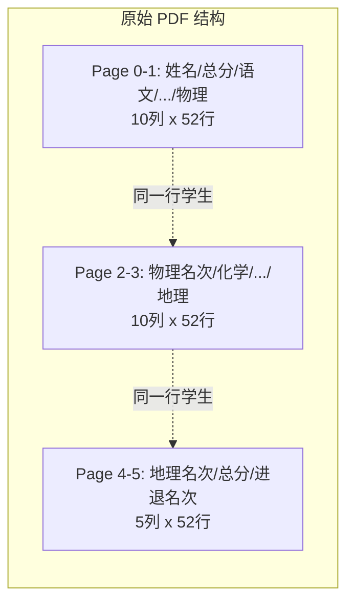

# 跨页表格合并问题分析与修复方案

## 问题本质

这份成绩 PDF 的原始结构是一张**横向分页的宽表**（52名学生 x 25列科目），被分成 6 页显示：



MinerU 的 `table_merge` 算法设计用于**纵向续表**（相同列、更多行），但这里是**横向续表**（相同行、更多列）。由于页 0 和页 1 恰好都有 10 列且在连续页面上，MinerU 误判为纵向续表，直接把页 1 的数据追加为页 0 的额外行。

layout.json 证据：
- `page_idx: 0` 的 HTML 包含 52 行数据 + 1 行新表头("物理名次/化学/...") + 52 行数据 = 105 行（错误合并）
- `page_idx: 1, 2, 3` 均标记 `"lines_deleted": true`
- `page_idx: 4` 有独立的 5 列 HTML 表
- `_version_name: "2.7.6"`，使用的是 `hybrid` 后端

## 为什么不能直接控制 MinerU

- `MINERU_TABLE_MERGE_ENABLE` 是**服务端环境变量**，用于自建的 `mineru-api`
- 我们调用的是**托管云端** `mineru.net/api/v4`，请求体中没有对应参数（[mineru_pdf_service.py](apps/worker/app/services/document_parser/mineru_pdf_service.py) 中只有 `enable_table`, `enable_formula`, `language`, `model_version`）
- MinerU 云端 API 不支持按请求粒度禁用 table merge

## 解决方案（推荐分层实施）

### 方案 A：后处理检测与拆分（推荐，优先实施）

在 MinerU 返回 `full.md` 之后、进入 `parse_md` 之前，增加一个**表格完整性校验 + 拆分**步骤。

**核心思路**：扫描 HTML 表格的每一行，检测"表头行出现在表中间"的异常模式。

**检测算法**：
1. 解析 `<table>` 为行列结构
2. 跳过第 1 行（真实表头）
3. 对后续每一行，计算"非纯数字单元格"的占比
4. 如果某行中 >= 70% 的单元格是非数字文本（如"物理名次"、"化学"等），判定为**伪表头行**
5. 在伪表头行处将表拆分为独立的 `<table>` 块

**实施位置**：[pdf_parser.py](apps/worker/app/services/document_parser/pdf_parser.py) 的 `_inject_page_markers` 之后、`parse_md` 之前，新增 `_split_wrongly_merged_tables(output_dir)` 函数，直接修改 `full.md`。

```python
def _split_wrongly_merged_tables(output_dir: str) -> None:
    """Detect and split tables where MinerU incorrectly merged 
    horizontally-split pages as vertical continuation."""
    # 1. 读取 full.md
    # 2. 找到所有 <table>...</table> 块
    # 3. 对每个表：解析行，检测中间的伪表头行
    # 4. 在伪表头处拆分为多个独立表
    # 5. 写回 full.md
```

**辅助信号**：可以结合 `layout.json` 中的 `lines_deleted` 页面数量来判断是否需要检测（如果一个表合并了 > 1 个续页，优先检查）。

### 方案 B：基于 layout.json 的感知拆分（增强版 A）

利用 `layout.json` 中的**每页 table bbox** 信息增强检测：

- 当页 0 的 table bbox 宽度（如 `525-51=474`）与页 4 的 bbox 宽度（如 `289-51=238`）差异显著时，说明不是同一张续表
- 当合并后的表行数 = 被合并页数 x 单页行数（如 52x2=104 行 + 2 个表头行）时，几乎可以确认是横向分页的错误合并
- 检查合并前后列数是否一致：如果"续页"的列数一样但表头完全不同，说明是横向分页

### 方案 C：横向重组（完美但复杂，后续迭代）

在拆分后，进一步将多个具有**相同数据行数**的子表**按列合并**：

```
子表0（52行x10列：姓名...物理）+ 子表1（52行x10列：物理名次...地理）+ 子表2（52行x5列：地理名次...进退名次）
→ 合成表（52行x25列：完整学生成绩）
```

这是理想结果，但实现复杂度较高，可以作为后续优化。

## 推荐实施路径

先做方案 A（后处理拆分），它解决了核心问题（表格数据不会被混淆），且对已有 pipeline 侵入性最小。方案 B 和 C 作为后续增强。

修改的文件：
- [pdf_parser.py](apps/worker/app/services/document_parser/pdf_parser.py) - 添加拆分逻辑调用
- 新建或扩展 [html_parser.py](apps/worker/app/services/document_parser/html_parser.py) - 添加 `split_wrongly_merged_tables` 检测算法
