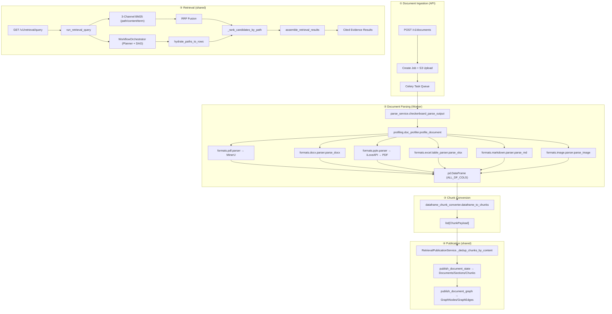
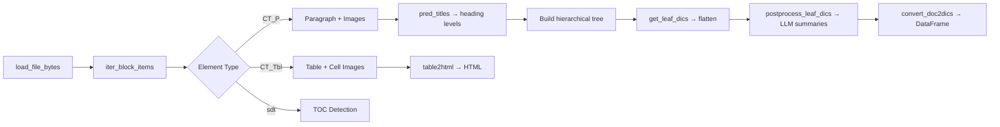
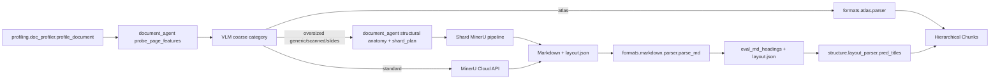
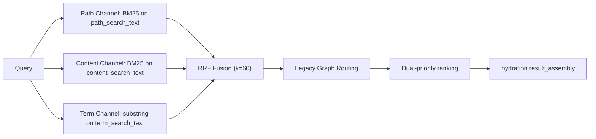

# Repository Instructions

## Branch Naming

Codex agents and contributors must create branches with this format:

```text
<type>/<user>/<description>
```

- `type` should be lowercase and should normally be one of:
  `feat`, `fix`, `refactor`, `chore`, `docs`, `test`, `perf`, `ci`, `build`,
  or `revert`.
- `user` should identify the human owner of the work, usually their GitHub
  username. Do not use a generic tool name such as `codex`.
- `description` should be short, lowercase, and kebab-case.

Examples:

```text
feat/alice/add-document-preview
fix/bob/chunk-position-range
refactor/chris/extract-chunk-converter
```

---

## Project Structure

```text
knowhereapi-main/
├── apps/
│   ├── api/          # FastAPI REST API (port 5005)
│   │   ├── app/
│   │   │   ├── api/v1/routes/   # Endpoint handlers
│   │   │   ├── services/        # Business logic (auth, ingestion, billing)
│   │   │   └── repositories/    # Data access layer
│   │   └── main.py              # Entrypoint, runs migrations on start
│   ├── worker/       # Celery worker for async document processing
│   │   ├── app/
│   │   │   ├── services/document_parser/  # All parser modules
│   │   │   └── services/workload/         # Celery task handlers
│   │   └── worker.py                      # Celery entrypoint
│   ├── web/          # Frontend (separate repo: knowhere-dashboard)
│   └── docs/         # Internal documentation
├── packages/
│   └── shared-python/shared/    # Shared library (pip: knowhere-shared)
│       ├── models/database/     # SQLAlchemy ORM models
│       ├── models/schemas/      # Pydantic request/response schemas
│       ├── services/retrieval/  # Core retrieval engine
│       ├── services/chunks/     # DataFrame → ChunkPayload conversion
│       ├── services/ai/         # LLM prompt service & AI client
│       ├── services/http/       # Public URL validation and outbound HTTP
│       ├── services/redis/      # Redis state, key language, and retry policy
│       ├── services/quota/      # Shared token-pool quota primitives
│       └── utils/               # Generic text, chunk, and API helpers
└── deploy/                      # Docker Compose & deployment scripts
```

> **SDKs live in standalone repos:**
> - Python SDK → [`Ontos-AI/knowhere-python-sdk`](https://github.com/Ontos-AI/knowhere-python-sdk)
> - Node SDK → [`Ontos-AI/knowhere-node-sdk`](https://github.com/Ontos-AI/knowhere-node-sdk)

---

## End-to-End Pipeline Overview



---

## Stage ②: Document Parsing Pipeline

### Entry Point

`apps/worker/app/services/document_parser/parse_service.py` →
`checkerboard_parse_output()`

This is the typed `ParseOutput` entry for all file types. The parser flow:

1. **Profiles** the document via `profiling.doc_profiler.profile_document()`. PDF
   profiling uses `document_agent` as the single PyMuPDF feature source, then runs
   VLM coarse classification with two fields: open semantic `category` (for example,
   `Financial Prospectus`) and routing-only `routing_category`
   (`atlas/scanned/slides/generic`). Oversized non-atlas PDFs additionally run the
   structural anatomy stage once at the entry point and pass the resulting shard
   plan to PDF parsing.
2. **Routes** to the appropriate parser based on file extension.
3. **Post-processes**: cleans up unreferenced images, compresses PNG→JPG.
4. Returns typed parse output with task-local artifact paths.

### Parser Routing Table

| Extension | Parser Module | Strategy |
|:---|:---|:---|
| `.pdf` | `formats.pdf.parser.parse_pdfs` | DOC_PROFILE category dispatch: `atlas` → atlas parser; oversized with entry anatomy → shard MinerU; otherwise MinerU API → Markdown parser → `structure.layout_parser.pred_titles` |
| `.docx` | `formats.docx.parser.parse_docx` + `convert_doc2dics` | OXML iteration → heading detection → hierarchical tree |
| `.doc` | `conversion.legacy_converter.doc_to_docx` → `.docx` pipeline | LibreOffice headless conversion first |
| `.pptx` | `formats.pptx.parser.parse_pptx` | iLoveAPI PPTX→PDF → MinerU pipeline |
| `.xlsx` | `formats.excel.table_parser.parse_xlsx` | Sheet-by-sheet HTML table extraction |
| `.xls` | `conversion.legacy_converter.xls_to_xlsx` → `.xlsx` pipeline | LibreOffice conversion first |
| `.md` | `formats.markdown.parser.parse_md` | Markdown heading parsing + LLM summaries |
| `.txt` | `formats.text.parser.parse_texts` → Markdown parser | Read lines then route to MD parser |
| `.png/.jpg` | `formats.image.parser.parse_image` | VLM image description + OCR |
| `.fragment` | `formats.fragment.parser.parse_fragment` | Raw text fragment ingestion |

### Heading Detection: `structure.layout_parser.pred_titles()`

The core hierarchical recognition module. Determines heading levels using:

1. **TOC-first**: If a DOCX TOC exists (`structure.toc_parser.build_docx_toc_hierarchies`),
   use it as ground truth for heading levels.
2. **Regex patterns**: Match numbered headings like `1.2.3`, `第X章`, `（一）`.
3. **LLM smart parse**: When `smart_title_parse=True`, send candidate headings
   to the hierarchy model (`HIERARCHY_LLM_MODEL` or `NORMOL_MODEL`) for level
   assignment.
4. **Font clustering (PDF)**: K-means on span heights from MinerU `layout.json`
   to group headings into 5 discrete tiers.

### DOCX Parsing Deep Dive: `formats/docx/parser.py`



Key logic in `parse_docx()`:

- **`iter_block_items()`**: Iterates OXML body elements, yielding
  `(ele_num, content, label, meta)` tuples. Labels: `PTXT`, `TABLE`,
  `IMAGE`, `TOC-AREA`.
- **Heading stack**: Maintains `headings_stack` with `{heading, content[], level}` 
  dicts. New headings pop the stack to their parent level.
- **Image dedup**: Uses `perceptual_hash()` for document-level visual dedup.
  Cached in `_seen_images` dict.
- **Table handling**: `table2html()` converts python-docx Table to HTML with
  accurate `rowspan`/`colspan` via direct OXML inspection.

### PDF Parsing: DOC_PROFILE + MinerU Pipeline



### LLM Models Used

| Task | Config Key | Default Model |
|:---|:---|:---|
| Text/table summarization | `NORMOL_MODEL` | `deepseek-chat` |
| Heading hierarchy recognition | `HIERARCHY_LLM_MODEL` | Falls back to `NORMOL_MODEL` |
| Image description (VLM) | `IMAGE_MODEL` | `qwen3.6-flash` |
| Image OCR / Q&A | `IMAGE_MODEL_MAX` | `qwen3.6-flash` |
| PDF coarse classification | `IMAGE_MODEL` | `qwen3.6-flash` |

---

## Persisted Document Corpus Schema (On-Disk Output)

After parsing and chunk conversion, results are persisted to `~/.knowhere/{corpus_name}/`.
This on-disk structure is the **authoritative persisted format** — the intermediate
DataFrame is an internal detail. Below is the complete schema.

### Corpus-Level Directory Layout

```text
~/.knowhere/{corpus_name}/
├── knowledge_graph.json           # corpus-wide graph: file metadata + cross-doc edges
├── chunk_stats.json               # Per-chunk retrieval hit analytics {chunk_id → stats}
├── {source_file_name}/            # One directory per ingested document
│   ├── chunks.json                # All parsed chunks for this document
│   ├── doc_nav.json               # Hierarchical navigation tree for agentic retrieval
│   ├── manifest.json              # Parse metadata + full heading hierarchy
│   ├── {source_file_name}.zip     # Archived original + parsed assets
│   ├── images/                    # Extracted image assets (PNG/JPG)
│   ├── tables/                    # Extracted table assets (HTML)
│   ├── preds_3_llm_base.csv       # Debug: heading predictions (base LLM pass)
│   ├── preds_4_llm_final.csv      # Debug: heading predictions (final LLM pass)
│   ├── preds_5_final_output.csv   # Debug: final parser DataFrame output
│   └── toc_hierarchies.json       # Debug: extracted TOC structure (DOCX only)
```

### `knowledge_graph.json` — Corpus-Wide Graph

```json
{
  "version": "2.0",
  "corpus_id": "test-corpus",
  "stats": { "total_files": 3, "total_chunks": 364, "total_cross_file_edges": 0 },
  "files": {
    "AI_Security_Report.docx": {
      "chunks_count": 155,
      "types": { "image": 13, "table": 1, "text": 141 },
      "top_keywords": ["model", "security", "ai", "operations", "artificial_intelligence"],
      "top_summary": "This document includes: Legal Notice, Foreword, 1. Overview, ...",
      "importance": 0.3,
      "created_at": "2026-05-09T09:14:12.422208+00:00"
    }
  },
  "edges": []
}
```

| Field | Description |
|:---|:---|
| `files.{name}.top_keywords` | TF-IDF top keywords across all chunks (used for cross-doc edge scoring) |
| `files.{name}.top_summary` | Auto-generated outline of top-level headings (injected by `load_nav_top_summary()`) |
| `files.{name}.importance` | Base importance score (feeds `compute_importance_score()` in ranking) |
| `edges[]` | Cross-document edges with `{source, target, weight, shared_keywords}` when keyword overlap ≥ 0.8 |

### `chunk_stats.json` — Retrieval Hit Analytics

```json
{
  "2e2beffc-90b2-5429-8ee7-3c49260a1204": {
    "hit_count": 0,
    "first_hit": null,
    "last_hit": null,
    "created_at": "2026-05-09T09:14:12.423011+00:00"
  }
}
```

Keyed by `chunk_id`. `hit_count` and `last_hit` feed into `importance_norm_score`
for retrieval ranking boost.

### `chunks.json` — Per-Document Chunk Records

The core persisted data. Contains `{"chunks": [...]}` — an ordered array of
chunk objects. Three chunk types exist:

#### Text Chunk

```json
{
  "chunk_id": "d88e4c47-3c48-5bdf-b849-693c00453021",
  "type": "text",
  "content": "AI Security Report\n\nThe image displays a tech theme...\n[images/image-1 ai_model.png]\n",
  "path": "test_kb/AI_Security_Report.docx/1. Overview/1.1 Key Findings",
  "metadata": {
    "length": 220,
    "summary": "",
    "page_nums": [],
    "tokens": ["model", "technology", "market", "research", "report"],
    "keywords": [],
    "connect_to": [
      {
        "target": "2e2beffc-90b2-5429-8ee7-3c49260a1204",
        "relation": "embeds",
        "ref": "[images/image-1 ai_model.png]",
        "position": { "start": 109, "end": 135 }
      }
    ]
  }
}
```

#### Image Chunk

```json
{
  "chunk_id": "2e2beffc-90b2-5429-8ee7-3c49260a1204",
  "type": "image",
  "content": "\nThe image displays a tech theme...\n[images/image-1 ai_model.png]\n",
  "path": "images/image-1 ai_model.png",
  "metadata": {
    "length": 121,
    "summary": "image-1\nThe image displays a tech theme...",
    "page_nums": [],
    "file_path": "images/image-1 ai_model.png",
    "keywords": [],
    "tokens": []
  }
}
```

#### Table Chunk

```json
{
  "chunk_id": "a5c3d644-479a-51f9-9a54-ff6789c1f6e8",
  "type": "table",
  "content": "<table border='1'><tr><td>Architecture Layer</td><td>AI Capabilities</td></tr>...</table>",
  "path": "tables/table-1 ai_architecture.html",
  "metadata": {
    "length": 488,
    "summary": "table-1\nThe table shows the architecture layers...",
    "page_nums": [],
    "file_path": "tables/table-1 ai_architecture.html",
    "keywords": ["AI_Capabilities", "Security_Engine", "Intelligent_Collaboration"],
    "tokens": []
  }
}
```

#### Chunk Field Reference

| Field | Type | Description |
|:---|:---|:---|
| `chunk_id` | `str` | Deterministic UUID5 hash from content (`gen_str_codes`) — enables cross-doc dedup |
| `type` | `str` | `"text"` / `"image"` / `"table"` |
| `content` | `str` | Raw text, VLM description + asset ref, or HTML `<table>` |
| `path` | `str` | Hierarchical path: `{kb}/{file}/{section1}/{section2}/...` for text; `images/...` or `tables/...` for assets |
| `metadata.length` | `int` | Character count of content |
| `metadata.summary` | `str` | LLM summary (images/tables: `"image-N\n{description}"`) |
| `metadata.tokens` | `list[str]` | Pre-tokenized Chinese terms for BM25 retrieval |
| `metadata.keywords` | `list[str]` | LLM-extracted keywords (semicolon-split from DataFrame) |
| `metadata.page_nums` | `list[int]` | Source page numbers (PDF only) |
| `metadata.file_path` | `str` | Relative asset path for images/tables |
| `metadata.connect_to` | `list[ConnectionValue]` | Cross-chunk references (text→image/table embeddings) |
| `metadata.connect_to[].target` | `str` | Target chunk_id |
| `metadata.connect_to[].relation` | `str` | `"embeds"` (inline asset) or `"related"` |
| `metadata.connect_to[].ref` | `str` | Original reference string: `"[images/image-1.png]"` |
| `metadata.connect_to[].position` | `{start, end}` | Character offset of the reference in content |

### `doc_nav.json` — Hierarchical Navigation Tree

Used by agentic retrieval for 2-level section browsing. Structure:

```json
{
  "version": "1.0",
  "file_name": "AI_Security_Report.docx",
  "stats": { "total_chunks": 155, "text_chunks": 141, "image_chunks": 13, "table_chunks": 1, "max_depth": 4 },
  "sections": [
    {
      "title": "1. Overview",
      "path": "test_kb/AI_Security_Report.docx/1. Overview",
      "level": 1,
      "summary": "This section covers: 1.1 Key Findings, 1.2 Recommendations",
      "chunk_count": 6,
      "children": [
        {
          "title": "1.1 Key Findings",
          "path": "test_kb/.../1. Overview/1.1 Key Findings",
          "level": 2,
          "summary": "This section covers: Supply Side Perspective, Demand Side Perspective...",
          "chunk_count": 4,
          "children": [...]
        }
      ]
    }
  ],
  "resources": {
    "images": [{ "path": "images/image-1 ai_model.png", "summary": "image-1 The image displays a tech theme..." }],
    "tables": [{ "path": "tables/table-1 ai_architecture.html", "summary": "table-1 The table shows..." }]
  }
}
```

### `manifest.json` — Parse Metadata & Heading Hierarchy

```json
{
  "version": "2.0",
  "job_id": "AI_Security_Report.docx",
  "source_file_name": "AI_Security_Report.docx",
  "processing_date": "2026-05-09T07:46:00.395048Z",
  "statistics": { "total_chunks": 155, "text_chunks": 141, "image_chunks": 13, "table_chunks": 1 },
  "HIERARCHY": {
    "Root": {},
    "1. Overview": {
      "1.1 Key Findings": { "Supply Side Perspective": {}, "Demand Side Perspective": {} },
      "1.2 Recommendations": {}
    },
    "2. History of AI in Cybersecurity": { "...": {} }
  }
}
```

The `HIERARCHY` field is a nested dict representing the full heading tree
discovered by `structure.layout_parser.pred_titles()`. Each key is a heading title;
its value is a dict of child headings (empty `{}` for leaf nodes).

### Intermediate DataFrame (`ALL_DF_COLS`)

Parsers internally produce a `pd.DataFrame` with columns:
`content, path, type, length, keywords, summary, know_id, tokens, connectto, addtime, page_nums`.
This is converted to `ChunkPayload` objects via `dataframe_chunk_converter.dataframe_to_chunks()`
before persisting to `chunks.json`. The DataFrame is a transient internal format;
debug CSVs (`preds_*.csv`) are saved alongside for troubleshooting.

---

## Stage ④: Publication — Database Schema

### Core Tables

#### `documents`

| Column | Type | Description |
|:---|:---|:---|
| `document_id` | `String(36)` PK | `doc_{uuid_hex[:12]}` |
| `user_id` | `Text` FK → `user.id` | Owner |
| `namespace` | `String(255)` | Isolation scope (default: `"default"`) |
| `status` | `String(32)` | `active` / `archived` |
| `current_job_result_id` | `String(36)` FK | Points to active revision |
| `source_file_name` | `Text` | Original filename |

#### `document_sections`

| Column | Type | Description |
|:---|:---|:---|
| `section_id` | `String(36)` PK | `sec_{uuid_hex[:12]}` |
| `document_id` | FK → `documents` | Parent document |
| `job_result_id` | FK → `job_results` | Revision |
| `parent_section_id` | FK → self | Parent section (tree structure) |
| `section_path` | `Text` UNIQUE(doc+rev+path) | `"file.docx / Chapter 1 / Section 1.1"` |
| `section_title` | `Text` | Heading text |
| `section_level` | `Integer` | Depth in hierarchy (1-based) |
| `summary` | `Text` | Section summary |
| `sort_order` | `Integer` | Display order |

#### `document_chunks`

| Column | Type | Description |
|:---|:---|:---|
| `id` | `String(36)` PK | `dchk_{uuid_hex[:12]}` |
| `chunk_id` | `String(64)` | Content hash (deterministic dedup key) |
| `document_id` | FK → `documents` | Parent document |
| `section_id` | FK → `document_sections` | Parent section |
| `chunk_type` | `String(64)` | `text` / `image` / `table` |
| `content` | `Text` | Chunk content (text/HTML) |
| `content_search_text` | `Text` | Pre-tokenized for BM25 content channel |
| `path_search_text` | `Text` | Pre-tokenized for BM25 path channel |
| `term_search_text` | `Text` | Pre-tokenized for term/grep channel |
| `content_search_tsv` | `TSVECTOR` (computed) | PostgreSQL GIN index for full-text |
| `path_search_tsv` | `TSVECTOR` (computed) | PostgreSQL GIN index for path |
| `source_chunk_path` | `Text` | Original parser path |
| `file_path` | `Text` | Asset reference (`images/x.jpg`) |
| `chunk_metadata` | `JSON` | Keywords, tokens, connect_to, etc. |
| `sort_order` | `Integer` | Display order |

#### `graph_nodes`

| Column | Type | Description |
|:---|:---|:---|
| `node_id` | `String(128)` PK | `doc:{document_id}` |
| `node_kind` | `String(32)` | `document` (only doc-level nodes) |
| `owner_document_id` | FK → `documents` | Source document |
| `properties` | `JSON` | `{source_file_name, top_keywords, chunks_count, types, top_summary}` |

#### `graph_edges`

| Column | Type | Description |
|:---|:---|:---|
| `edge_id` | `String(160)` PK | `related:{doc_a}<->{doc_b}` (sorted pair) |
| `edge_kind` | `String(32)` | `related` |
| `source_node_id` / `target_node_id` | FK → `graph_nodes` | Connected docs |
| `weight` | `Float` | Keyword overlap score (≥ 0.8 threshold) |
| `properties` | `JSON` | `{shared_keywords, connection_count}` |
| `is_directed` | `Boolean` | Always `False` for related edges |

### Publication Logic

`RetrievalPublicationService.publish_document_state()`:

1. **Dedup**: Cross-document content-hash dedup via `_dedup_chunks_by_content`.
2. **Section tree**: Builds `DocumentSection` tree from chunk paths, creating
   ancestor sections top-down.
3. **Search text**: Generates 3 search text channels per chunk:
   - `content_search_text`: Tokenized content + summary
   - `path_search_text`: Tokenized file name + section path + summary
   - `term_search_text`: Raw content + path for substring grep
4. **Graph**: `DocumentGraphService.publish_document_graph()` creates doc-level
   `GraphNode` with TF-IDF keywords, then keyword-overlap `GraphEdge`s to peer
   documents (min 3 shared keywords, score ≥ 0.8).

---

## Stage ⑤: Retrieval Engine

### Entry Point

`shared/services/retrieval/app_service.py` → `run_retrieval_query()`

Core retrieval internals are grouped by ownership:

- `execution/`: request shaping, route selection, legacy route execution, and public response projection.
- `search/`: lexical channels, scoring, section filters, and candidate ranking.
- `hydration/`: row/path/reference hydration, inline assets, and result assembly.
- `graph/`: document graph publication/query support.
- `stats/`: retrieval hit recording.
- `workflow/`: query planning, retrieve step execution, and wallet state.
- `agentic/core/`: agentic run types, token budgets, runtime config, and traces.
- `agentic/discovery/`: bottom discovery and document selection.
- `agentic/navigation/`: section-tree navigation, selection hydration, and asset tools.
- `agentic/evidence/`: evidence tree rendering and budget trimming.

### Two Retrieval Modes

The system supports two modes, controlled globally by `RETRIEVAL_AGENTIC_ENABLED` and locally via the per-request `use_agentic` toggle.

#### Legacy Mode (3-Channel RRF)



**Channel weights** (default): path=1.0, content=2.0, term=1.5
**RRF formula**: `score = weight / (k + rank + 1)` per channel, summed across channels.

#### Agentic Mode (Workflow Orchestrator)

The agentic pipeline uses `WorkflowOrchestrator` to handle complex queries via a DAG-based planning and budget-constrained execution engine:

1. **Planning (`PlannerAgent`)**: The query is analyzed and decomposed into a DAG of retrieval steps.
   - Simple queries generate a single `retrieve` step.
   - Complex queries are broken into multiple `retrieve` steps. KNOWHERE does not plan answer synthesis steps.
2. **Budget Ledger (`BudgetLedger`)**: A strict token budget mechanism is enforced across the entire DAG execution. If the budget is exhausted, the pipeline halts safely and returns the best-effort evidence collected so far.
3. **Execution (`RetrievalAgent`)**: For each `retrieve` step, a multi-phase navigation engine runs:
   - **Phase 1 (Discovery)**: 3-channel RRF keyword search and KG document selection.
   - **Phase 2 (Navigation)**: Constrained Breadth-First Search (BFS) over the document's section tree. Discovered orphan leaves are merged into the tree to prevent data loss.
   - **Phase 3 (Evidence Rendering)**: The hydrated document tree is rendered as `evidence_text`.
4. **Evidence-Only Contract**: Retrieval responses always expose `evidence_text` as the primary output. `answer_text` is retained only as a deprecated empty string. Downstream agents decide whether the evidence is sufficient and synthesize answers outside KNOWHERE.

### Tree Rendering & Hydration

Unlike legacy retrieval which relied on static `hydrate_mode` tags, hydration is now determined dynamically by the `DocTreeNode` structure:
- **Structural Context (Outlines)**: Sections not drilled into are simply rendered as structural outlines (`title` + `summary`) to guide the LLM.
- **Leaf Content (Hydration)**: Sections that the LLM explicitly selects for drill-down have their raw chunks (`text`, `image`, `table`) fully hydrated into the `leaf_content` of the tree.
- **Multi-Modal Inline Embedding**: During hydration, connected inline assets (images/tables) are natively resolved and embedded directly into the text chunk content, supporting multi-modal LLM processing without brittle string-replacement placeholders.

**`_rank_candidates_by_path()`** — Dual-priority ranking:

- When agent results exist: agent_score is primary, discovery_score is tiebreaker
- Rows with agent_score=0 are demoted to fallback pool
- Sort key: `(agent_score, discovery_score, dual_hit_flag, importance_norm_score)`

### Result Assembly

`hydration.result_assembly.assemble_retrieval_results()`:

1. Filters by `exclude_document_ids` and `exclude_sections`
2. Filters by `allowed_chunk_types` (data_type parameter)
3. Hydrates `connect_to` targets (related table chunks inlined into text)
4. Cleans asset path references from content
5. Attaches citation: `{document_id, chunk_id, source_file_name, section_path}`

### Small Corpus Optimization

When `total_chunks <= top_k`, skips the full pipeline and returns all chunks
directly (router: `small_corpus_all`).

### Caching

Results are cached per `(user_id, namespace, query, top_k, filters)` via
`cache_service`. Cache version is checked before execution; cache is written
after successful retrieval.

---

## Analytics Tables

#### `retrieval_hit_stats`

Tracks per-chunk and per-document retrieval usage. `hit_count` and `last_hit_at`
feed into `compute_importance_score()` for ranking boost.

#### `retrieval_runs` / `retrieval_steps`

Append-only agentic retrieval analytics. One `retrieval_runs` row per query,
with child `retrieval_steps` rows recording each agent action, its input/output,
latency, and token usage.

---

## Key Implementation Patterns

### Deterministic Chunk IDs

`know_id = gen_str_codes(pure_text)` — SHA-based hash of text content only
(excludes image/table asset refs). This enables cross-document dedup:
identical text in different uploads produces the same `chunk_id`.

### Plan-then-Act DOM Mutation

When splitting tables or modifying document structure:
1. **Pass 1 (Investigate)**: Collect mutation targets into a static plan
2. **Pass 2 (Execute)**: Apply mutations in **reverse order** to avoid index shifting

### Image Dedup: Perceptual Hash

`perceptual_hash()` computes a visual fingerprint. Images with identical
hashes are deduplicated within a document, with cached metadata reused.

### Asset Lifecycle (Deterministic UIDs)

`IMAGE_[hash(content+seq)]_IMAGE` — identical images at different positions
receive unique IDs. Context chaining prevention scans backward past binary
identifiers to find the nearest valid text.

### LLM Constraints

- **DeepSeek JSON mode**: Requires the word "json" in the prompt when
  `response_format` is `json_object`
- **Streaming robustness**: Concatenate `delta.content` only if `not None`
- **Token pool rotation**: Ali API keys support per-token RPM limits,
  cooldown, and inline retry with next available token

---

## Development & Debugging

### Local Setup

```bash
uv sync --all-packages
cp apps/api/.env.example apps/api/.env
cp apps/worker/.env.example apps/worker/.env
./deploy/local-dev/start-dev.sh        # PostgreSQL, Redis, LocalStack
cd apps/api && uv run main.py          # API on :5005
cd apps/worker && uv run worker.py     # Celery worker
```

### Debug Scripts (Worker)

| Script | Purpose |
|:---|:---|
| `debug_parse.py` | Unified parsing debug: all formats, `--stop-at profile/hierarchy/full`, `--run-db` |
| `debug_agentic_e2e.py` | End-to-end agentic retrieval test |
| `debug_profiler.py` | Document profiler testing |
| `debug_toc_detection.py` | TOC detection and hierarchy building |

### Quality Checks

```bash
make lint          # Ruff lint
make lint-fix      # Auto-fix safe issues
make typecheck     # Pyright across api, worker, shared
make check         # Both lint + typecheck
```

### Local Endpoints

| Service | URL |
|:---|:---|
| API | `http://localhost:5005` |
| OpenAPI docs | `http://localhost:5005/docs` |
| PostgreSQL | `localhost:5432` |
| Redis | `localhost:6379` |
| LocalStack (S3) | `http://localhost:4566` |
