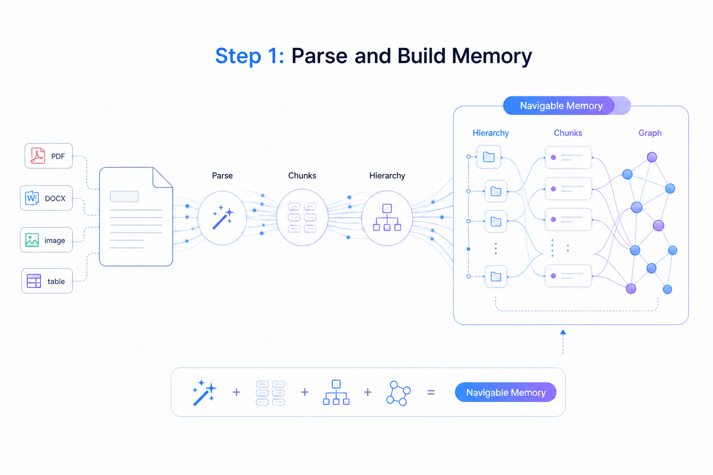
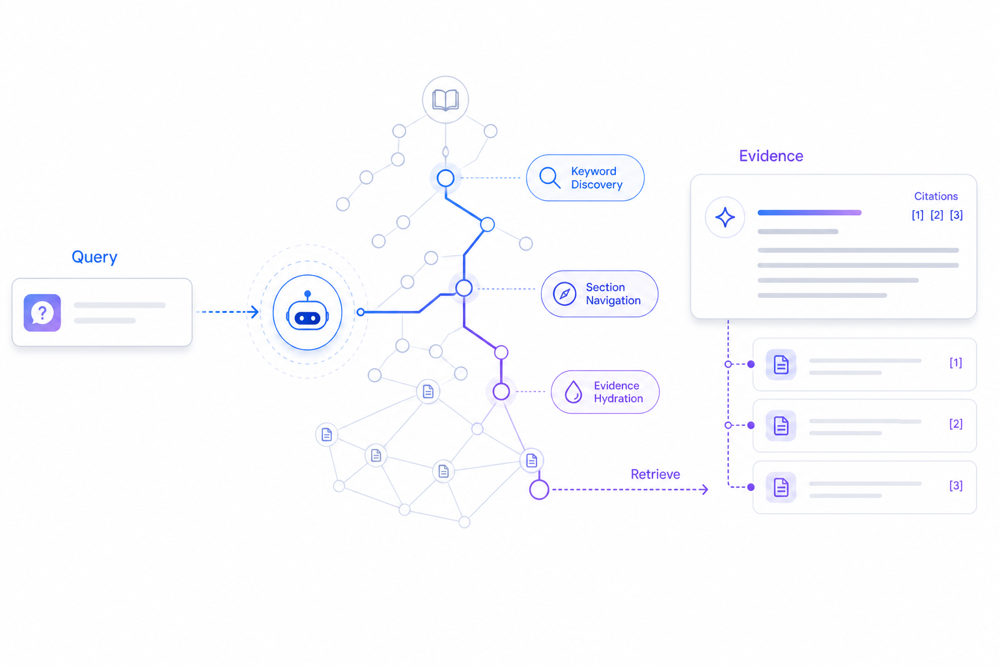
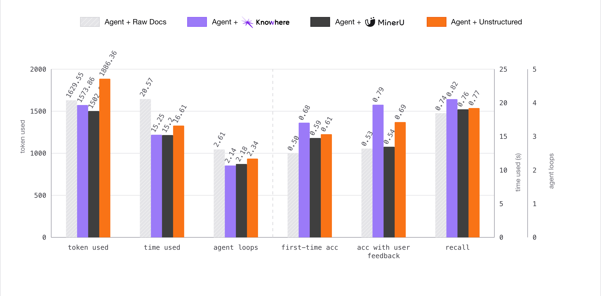

<h1 align="center">Prepare unstructured data for AI Agents</h1>

<p align="center">
  <a href="https://www.python.org/downloads/">
    
  </a>
  <a href="https://github.com/Ontos-AI/knowhere/stargazers">
    
  </a>
  <a href="https://github.com/Ontos-AI/knowhere/actions">
    
  </a>
  <br>
  <a href="https://github.com/Ontos-AI/knowhere/discussions">
    
  </a>
  <a href="https://ghcr.io/ontos-ai/knowhere">
    
  </a>
  <a href="https://github.com/Ontos-AI/knowhere/blob/main/LICENSE">
    
  </a>
</p>

<p align="center">
  🔗 <a href="https://knowhereto.ai">Website</a> |
  📄 <a href="https://docs.knowhereto.ai/">Docs</a> |
  🏠 <a href="https://github.com/Ontos-AI/knowhere-self-hosted">Self-Host</a> |
  🖥️ <a href="https://github.com/Ontos-AI/knowhere-dashboard">Dashboard</a>
</p>

## Overview

**Knowhere is the memory layer between complex, dirty documents and AI agents.**

It ingests unstructured documents and produces persistent, navigable memory: parsing, hierarchy extraction, multi-modal structuring, and graph construction in a single pipeline. Every chunk retains full semantic context, making the output a natural fit for *Agentic RAG*, *vector-based RAG*, or any LLM workflow.

> [!NOTE]
> **Get started in seconds with Knowhere Cloud.**
> Avoid the complexity of self-deployment. Use our managed API at [knowhereto.ai](https://knowhereto.ai) and enjoy **$5 in free credits** upon registration.

## 📢 News

- **May 7, 2026**: 🚀 **Knowhere is now Open Source!** We have open-sourced our entire stack for document ingestion, parsing, and agentic RAG. You can now self-host the full platform using [knowhere-self-hosted](https://github.com/Ontos-AI/knowhere-self-hosted). Check out our [Contribution Guide](CONTRIBUTING.md) to get involved!

## How it Works

Knowhere runs in two steps: build memory from documents, then let agents retrieve from it.

### Step 1: Parse and Build Memory

<p align="center">
  
</p>

- **Parse**: Route PDFs, Office files, images, tables, Markdown, and text to specialized parsers.
- **Structure**: Our proprietary Tree-like algorithm reconstructs the full document hierarchy instead of flattening it into a sequence, preventing semantic fragmentation across chunks.
- **Build Memory**: Store chunks, navigation trees, summaries, and graph links as agent-ready context.

### Step 2: Agentic Retrieval

<p align="center">
  
</p>

- **Discover**: Fuse keyword, path, content, and semantic signals for broad first-pass coverage.
- **Navigate**: Walk section trees and graph links to drill into the most relevant document regions.
- **Cite Evidence**: Return traceable results with source document, section, chunk, and linked assets.

## FAQ

**Q: What is Knowhere's relationship with MinerU?**

A: Knowhere uses MinerU as its default parser because it performs best in our tests. Any parser only gets you raw Markdown. Knowhere's value is what comes after: hierarchy reconstruction, multi-modal normalization, and cross-document graph construction. Any Markdown-outputting tool works.

**Q: What LLM / VLM dependencies does Knowhere have?**

A: By default, DeepSeek (`deepseek-chat`) handles text and table summarization, and Qwen-VL (`qwen3.5-flash`) handles image OCR and descriptions. Knowhere is model-agnostic. Swap in OpenAI, DashScope, Zhipu, or Volcengine via environment variables.

**Q: How is Agentic Retrieval different from traditional RAG?**

A: Traditional RAG does a flat vector lookup and returns isolated snippets. Knowhere's agents navigate the document's section tree and cross-document graph, drilling into the most relevant regions the way a human reader would, returning traceable, well-contextualized evidence.

**Q: Does it handle images and tables?**

A: Yes. Knowhere extracts them, runs them through VLMs for summarization and feature extraction, and links them back to their source chunks so agents can retrieve and cite multi-modal assets at inference time.

## Performance Benchmark

Agents using Knowhere outperform those working from raw documents, MinerU-parsed output, or Unstructured output on real-world tasks: searching, modifying, and answering questions.

<p align="center">
  
</p>

> **We're not developing the next MinerU — we're building document memory infrastructure that agents can effectively consume.**

### Key Advantages

- **Accuracy**: +36% first-try accuracy and +11% recall over raw documents.
- **Reliability**: 79% accuracy with feedback, vs. a ~53% ceiling on raw docs.
- **Efficiency**: Fewer agent loops than every baseline, with lower token and time costs than raw documents or Unstructured output.

*(Internal evaluation across identical agentic RAG tasks. Baselines: raw documents, MinerU output, and Unstructured output fed directly to agents.)*

> [!NOTE]
> **📊 Benchmarks are actively expanding.** More parsers and retrieval baselines coming soon.

## Ecosystem

| Repository | Description |
|---|---|
| [knowhere](https://github.com/Ontos-AI/knowhere) | **This repo.** Backend API and worker: document ingestion, parsing, graph construction, and retrieval. |
| 🖥️ [knowhere-dashboard](https://github.com/Ontos-AI/knowhere-dashboard) | The web UI. Connects to the API for the full product experience. |
| 🐳 [knowhere-self-hosted](https://github.com/Ontos-AI/knowhere-self-hosted) | Docker Compose stack for self-hosted deployments. Packages the API, worker, and dashboard together. |
| 🐍 [knowhere-python-sdk](https://github.com/Ontos-AI/knowhere-python-sdk) | Official Python SDK for the Knowhere Cloud API. |
| 🦕 [knowhere-node-sdk](https://github.com/Ontos-AI/knowhere-node-sdk) | Official Node.js SDK for the Knowhere Cloud API. |

## Features

- **Multi-modal Parsing**: High-fidelity extraction from PDF, Office, and images, preserving headings, tables, and hierarchical paths.
- **Lightweight Memory Graph**: Context-aware organization that links documents and chunks for better relationship understanding.
- **Agentic RAG**: A hybrid retrieval engine combining traditional search (RRF) with autonomous agent navigation.
- **Evidence-based Citations**: Every result is backed by traceable source paths, ensuring reliability for AI Agent decision-making.

## Supported Formats

**✅ Supported**

- [x] `.pdf` `.docx` `.pptx` `.xlsx` `.csv`
- [x] `.jpg` `.png`
- [x] `.md` `.txt` `.json`

**⏳ Coming Soon**

- [ ] `.epub` `.html` `.xml`
- [ ] `.mp4` `.mp3`
- [ ] `.skills.md`

Want to see a new format supported? Adding a parser is a great first contribution. Check out [CONTRIBUTING.md](CONTRIBUTING.md) to get started.

## Prerequisites

- Python 3.11+
- `uv`
- Docker with `docker compose`

## Quick Start

1. Sync the workspace dependencies:

```bash
uv sync --all-packages
```

2. Copy the environment examples:

```bash
cp apps/api/.env.example apps/api/.env
cp apps/worker/.env.example apps/worker/.env
```

3. Update the copied `.env` files with the values you need for local work:

- database and Redis connection settings
- S3-compatible storage credentials
- at least one LLM provider key: `DS_KEY`, `ALI_API_KEYS`, `GPT_API_KEY`, or `GLM_API_KEY`
- `MINERU_API_KEYS` if you need PDF parsing
- a vision-capable model provider if you need image summaries, OCR, atlas classification, or image-aware retrieval
- any optional billing or webhook providers you want to enable

Most parser and retrieval tuning values have code defaults. Start with the
required external services first, then override model names, provider URLs,
budgets, or concurrency limits only when your deployment needs different
behavior. See [docs/external-services.md](docs/external-services.md) for the
full dependency matrix.

4. Start the local infrastructure stack:

```bash
./deploy/local-dev/start-dev.sh
```

5. Start the API and worker in separate terminals:

```bash
cd apps/api && uv run main.py
cd apps/worker && uv run worker.py
```

The API runs migrations during startup.

For API-only development without the dashboard, create an API-only user/key
after the API service starts:

```bash
cd apps/api
uv run scripts/init_user.py --email you@example.com
```

If you plan to use the dashboard, register through the dashboard instead of
using `scripts/init_user.py`.

The API is now running at `http://localhost:5005`. If you want the full product experience with a UI, run the [knowhere-dashboard](https://github.com/Ontos-AI/knowhere-dashboard) alongside it; it connects to this API out of the box.

## Quality Checks

Run lint checks from the repository root:

```bash
make lint
```

Apply safe Ruff fixes:

```bash
make lint-fix
```

Run type checks across the API, worker, and shared source code:

```bash
make typecheck
```

Run both lint and type checks:

```bash
make check
```

## Local Endpoints

- API: `http://localhost:5005`
- OpenAPI docs: `http://localhost:5005/docs`
- LocalStack: `http://localhost:4566`
- PostgreSQL: `localhost:5432`
- Redis: `localhost:6379`

## Additional Guides

- External dependency guide:
  [docs/external-services.md](docs/external-services.md)

## Citation

If you use Knowhere in your research, please cite it as:

```bibtex
@software{knowhere2026,
  author       = {Ontos AI},
  title        = {Knowhere: Prepare Unstructured Data for AI Agents},
  year         = {2026},
  publisher    = {GitHub},
  url          = {https://github.com/Ontos-AI/knowhere},
  version      = {2026.04.30.1},
  license      = {Apache-2.0}
}
```

## Communication

- [GitHub Discussions](https://github.com/Ontos-AI/knowhere/discussions) for questions, ideas, and general conversation.
- [GitHub Issues](https://github.com/Ontos-AI/knowhere/issues) for bug reports and feature requests.

## Contribution

Any contributions to Knowhere are more than welcome!

If you are new to the project, check out the [good first issues](https://github.com/Ontos-AI/knowhere/issues?q=is%3Aissue+is%3Aopen+label%3A%22good+first+issue%22). They are well-defined, relatively simple, and a great way to get familiar with the codebase and the contribution workflow.

For general guidelines on branching, commit conventions, and the review process, take a look at [CONTRIBUTING.md](CONTRIBUTING.md).

Other useful references:

- [SECURITY.md](SECURITY.md): how to report vulnerabilities responsibly.
- [CODE_OF_CONDUCT.md](CODE_OF_CONDUCT.md): community behavior expectations.
- [LICENSE](LICENSE) and [NOTICE](NOTICE): Apache 2.0.

## 👋 We're Hiring!

We're building the knowledge layer for the Agent era. If that sounds like work you want to do, reach out. Decode the address below and drop us a line:

```bash
echo 'dGVhbUBrbm93aGVyZXRvLmFp' | base64 --decode
```
