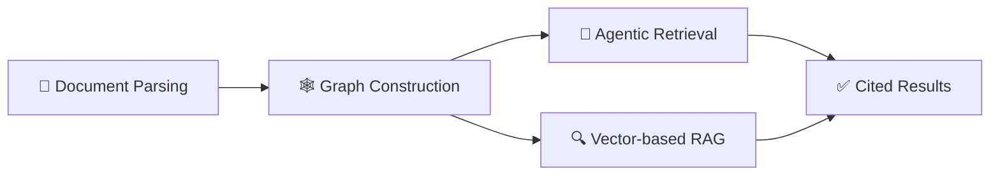

<h1 align="center">Prepare unstructured data for AI Agents</h1>

<p align="center">
  <a href="https://www.python.org/downloads/">
    
  </a>
  <a href="https://github.com/Ontos-AI/knowhere/stargazers">
    
  </a>
  <a href="https://github.com/Ontos-AI/knowhere/actions">
    
  </a>
  <br>
  <a href="https://github.com/Ontos-AI/knowhere/discussions">
    
  </a>
  <a href="https://ghcr.io/ontos-ai/knowhere">
    
  </a>
  <a href="https://github.com/Ontos-AI/knowhere/blob/main/LICENSE">
    
  </a>
</p>

<p align="center">
  🔗 <a href="https://knowhereto.ai">Website</a> |
  📄 <a href="https://docs.knowhereto.ai/">Docs</a> |
  🏠 <a href="https://github.com/Ontos-AI/knowhere-self-hosted">Self-Host</a> |
  🖥️ <a href="https://github.com/Ontos-AI/knowhere-dashboard">Dashboard</a>
</p>

Knowhere is the open-source infrastructure for unstructured data processing. It automates the complex pipeline of extracting, parsing, and transforming messy documents into structured, high-quality data optimized for *AI Agents*, *Agentic RAG*, and *traditional vector-based RAG workflows*.

> [!NOTE]
> **Get started in seconds with Knowhere Cloud.**
> Avoid the complexity of self-deployment. Use our managed API at [knowhereto.ai](https://knowhereto.ai) and enjoy **$5 in free credits** upon registration.

## 📢 News

- **May 7, 2026**: 🚀 **Knowhere is now Open Source!** We have open-sourced our entire stack for document ingestion, parsing, and agentic RAG. You can now self-host the full platform using [knowhere-self-hosted](https://github.com/Ontos-AI/knowhere-self-hosted). Check out our [Contribution Guide](CONTRIBUTING.md) to get involved!
- **Apr 30, 2026**: 📦 **Version [2026.04.30.1](https://github.com/Ontos-AI/knowhere/releases/tag/2026.04.30.1) has been released.** This update includes several stability improvements and initial support for the agentic RAG layer. See the [full changelog](https://github.com/Ontos-AI/knowhere/commits/2026.04.30.1) for details.

## How it Works

> [!TIP]
> **TL;DR**: Knowhere parses documents into structured units, maps them in a graph, and lets agents navigate that context to find and cite reliable evidence.

Knowhere turns raw documents into a structured memory store that AI agents can navigate and cite. The process follows a three-stage pipeline:



### 1. Document Parsing
Knowhere routes files to specialized parsers for PDFs, Office docs, images, and more. We don't just extract text; we preserve the document's hierarchy:
- **Hierarchical Paths**: Every chunk knows its exact location (e.g., `Section 2.1 > Table 4`).
- **Multi-modal Units**: Tables and images are treated as distinct assets with their own metadata.
- **Structural Awareness**: Heading levels and section boundaries are maintained to keep context intact.

### 2. Memory Graph
Parsed content is organized into a lightweight graph. It’s designed as a practical map for agents, not a complex ontology.
- **Nodes**: Represent documents, sections, and chunks.
- **Edges**: Map semantic relationships (keyword overlap, summaries) and structural links.
This graph helps agents quickly understand what a document is about and which neighboring files might be relevant.

### 3a. Agentic Retrieval
An agent navigates the memory graph to find evidence rather than relying on a single vector lookup:
- **Hybrid Discovery**: Fuses keyword and semantic search (RRF) for broad first-pass coverage.
- **Agent Navigation**: The agent "walks" the graph, reviewing section previews to drill down into the most relevant paths.
- **Cited Evidence**: Results are returned as traceable evidence — source document, section, chunk, and any linked image or table assets.

### 3b. Vector-based RAG
For teams that prefer a pure retrieval pipeline without agent overhead, Knowhere's parsed chunks plug directly into standard vector stacks:
- **Dense Search**: Chunk embeddings stored in Qdrant, pgvector, or Milvus for fast ANN lookup.
- **Sparse Search**: BM25 term index for keyword-sensitive queries.
- **Multi-channel Fusion**: Dense and sparse results are fused with RRF before being returned, giving you the best of both signals.

## Ecosystem

| Repository | Description |
|---|---|
| [knowhere](https://github.com/Ontos-AI/knowhere) | **This repo.** Backend API and worker — document ingestion, parsing, graph construction, and retrieval. |
| 🖥️ [knowhere-dashboard](https://github.com/Ontos-AI/knowhere-dashboard) | The web UI. Connects to the API for the full product experience. |
| 🐳 [knowhere-self-hosted](https://github.com/Ontos-AI/knowhere-self-hosted) | Docker Compose stack for self-hosted deployments. Packages the API, worker, and dashboard together. |
| 🐍 [knowhere-python-sdk](https://github.com/Ontos-AI/knowhere-python-sdk) | Official Python SDK for the Knowhere Cloud API. |
| 🦕 [knowhere-node-sdk](https://github.com/Ontos-AI/knowhere-node-sdk) | Official Node.js SDK for the Knowhere Cloud API. |

## Features

- **Multi-modal Parsing**: High-fidelity extraction from PDF, Office, and images, preserving headings, tables, and hierarchical paths.
- **Lightweight Memory Graph**: Context-aware organization that links documents and chunks for better relationship understanding.
- **Agentic RAG**: A hybrid retrieval engine combining traditional search (RRF) with autonomous agent navigation.
- **Evidence-based Citations**: Every result is backed by traceable source paths, ensuring reliability for AI Agent decision-making.

## Supported Formats

**✅ Supported**

- [x] `.pdf` `.docx` `.pptx` `.xlsx` `.csv`
- [x] `.jpg` `.png`
- [x] `.md` `.txt` `.json`

**⏳ Coming Soon**

- [ ] `.epub` `.html` `.xml`
- [ ] `.mp4` `.mp3`
- [ ] `.skills.md`

Want to see a new format supported? Adding a parser is a great first contribution. Check out [CONTRIBUTING.md](CONTRIBUTING.md) to get started.

## Prerequisites

- Python 3.11+
- `uv`
- Docker with `docker compose`
- a local Chrome or Chromium driver if you plan to run document layout parsing
  flows

## Quick Start

1. Sync the workspace dependencies:

```bash
uv sync --all-packages
```

2. Copy the environment examples:

```bash
cp apps/api/.env.example apps/api/.env
cp apps/worker/.env.example apps/worker/.env
```

3. Update the copied `.env` files with the values you need for local work:

- database and Redis connection settings
- S3-compatible storage credentials
- `SECRET_KEY`
- `USERS_DATA_PATH`
- `DS_KEY`
- any optional LLM, billing, or webhook providers you want to enable

The example files default to the open-source/self-hosted behavior:

- `API_STANDALONE_MODE_ENABLED=false` for the combined dashboard + API flow, where
  the dashboard initializes Better Auth tables before API migrations.
- `BILLING_ENABLED=false`, so Stripe and credit deduction are not required.
- `RATE_LIMIT_ENABLED=false` for local/self-hosted convenience; set it to
  `true` when you want API rate limits enforced.

For API-only development without the dashboard, set `API_STANDALONE_MODE_ENABLED=true`,
run API migrations, then create an API-only user/key:

```bash
cd apps/api
uv run --python 3.11 python -m alembic upgrade heads
uv run --python 3.11 python scripts/init_user.py --email you@example.com
```

If you plan to use the dashboard, start the combined self-hosted stack and
register through the dashboard instead of using `scripts/init_user.py`.

4. Start the local infrastructure stack:

```bash
./deploy/local-dev/start-dev.sh
```

If you also want the helper to initialize the local API user state, rerun it
with `--init-user`:

```bash
./deploy/local-dev/start-dev.sh --init-user
```

5. Start the API and worker in separate terminals:

```bash
cd apps/api && uv run main.py
cd apps/worker && uv run worker.py
```

The API is now running at `http://localhost:5005`. If you want the full product experience with a UI, run the [knowhere-dashboard](https://github.com/Ontos-AI/knowhere-dashboard) alongside it — it connects to this API out of the box.

## Quality Checks

Run lint checks from the repository root:

```bash
make lint
```

Apply safe Ruff fixes:

```bash
make lint-fix
```

Run type checks across the API, worker, and shared source code:

```bash
make typecheck
```

Run both lint and type checks:

```bash
make check
```

## Local Endpoints

- API: `http://localhost:5005`
- OpenAPI docs: `http://localhost:5005/docs`
- LocalStack: `http://localhost:4566`
- PostgreSQL: `localhost:5432`
- Redis: `localhost:6379`

## Additional Guides

- External dependency guide:
  [docs/external-services.md](docs/external-services.md)

## Citation

If you use Knowhere in your research, please cite it as:

```bibtex
@software{knowhere2026,
  author       = {Ontos AI},
  title        = {Knowhere: Prepare Unstructured Data for AI Agents},
  year         = {2026},
  publisher    = {GitHub},
  url          = {https://github.com/Ontos-AI/knowhere},
  version      = {2026.04.30.1},
  license      = {Apache-2.0}
}
```

## Communication

- [GitHub Discussions](https://github.com/Ontos-AI/knowhere/discussions) for questions, ideas, and general conversation.
- [GitHub Issues](https://github.com/Ontos-AI/knowhere/issues) for bug reports and feature requests.

## Contribution

Any contributions to Knowhere are more than welcome!

If you are new to the project, check out the [good first issues](https://github.com/Ontos-AI/knowhere/issues?q=is%3Aissue+is%3Aopen+label%3A%22good+first+issue%22). They are well-defined, relatively simple, and a great way to get familiar with the codebase and the contribution workflow.

For general guidelines on branching, commit conventions, and the review process, take a look at [CONTRIBUTING.md](CONTRIBUTING.md).

Other useful references:

- [SECURITY.md](SECURITY.md) — how to report vulnerabilities responsibly.
- [CODE_OF_CONDUCT.md](CODE_OF_CONDUCT.md) — community behavior expectations.
- [LICENSE](LICENSE) and [NOTICE](NOTICE) — Apache 2.0.

## 👋 We're Hiring!

We're building the knowledge layer for the Agent era. If that sounds like work you want to do, reach out — decode the address below and drop us a line:

```
dGVhbUBrbm93aGVyZXRvLmFp
```

`echo 'dGVhbUBrbm93aGVyZXRvLmFp' | base64 --decode`
