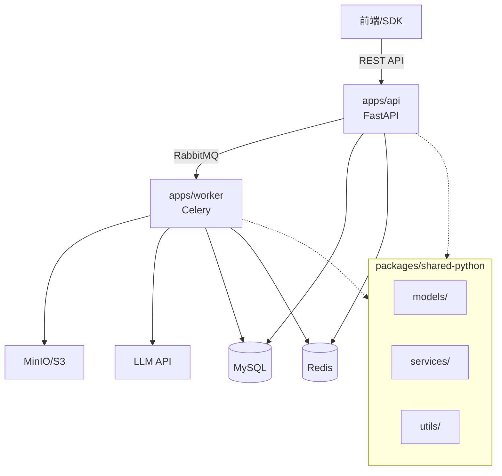
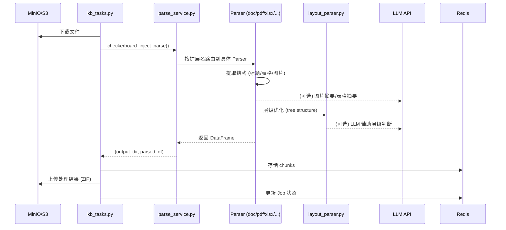

# Knowhere API — Project Tracker

> **Last session**: 2026-02-26 — Table Parser P0 评估 + MD 分隔线修复 + 关键词去重
> **Current branch**: feat/eric/parsing-update

---

## 0. Session Stats

| 日期 | 时长 | 输入 token (估) | 输出 token (估) | 摘要 |
|------|------|----------------|----------------|------|
| 2026-02-23 | 6m | ~100 | ~4K | 修复 skill 自动触发失败问题，改造 check-skills workflow |
| 2026-02-25 | ~1h 10m | ~3K | ~30K | iLoveAPI 集成、PPTX 解析 pipeline 重构为流式处理 + image-only PDF |
| 2026-02-26 | ~1h 10m | ~5K | ~40K | Table Parser P0 评估（HTMLHeaderExpander 移植+回滚）、MD 分隔线修复、关键词去重 |

---

## 1. Architecture Overview

### Tech Stack

| 维度 | 说明 |
|------|------|
| **构型** | pnpm workspace + Turborepo monorepo |
| **语言** | Python (FastAPI / Celery) + TypeScript (Next.js) |
| **基础设施** | MySQL · Redis · RabbitMQ · MinIO (S3) |
| **部署** | Docker Compose (dev) / Aliyun & AWS (prod) |

### Directory Structure

```
knowhere/
├── apps/
│   ├── api/             # FastAPI 后端 (port 5005)
│   ├── worker/          # Celery 异步 Worker
│   ├── web/             # Next.js 前端 (port 3000)
│   └── docs/            # 文档站 (port 3001)
├── packages/
│   ├── shared-python/   # Python 共享包 (models, services, utils)
│   ├── sdk-python/      # Python SDK
│   ├── sdk-typescript/  # TypeScript SDK
│   ├── shared-types/    # 共享类型定义
│   └── openapi-specs/   # OpenAPI 规范
├── deploy/              # 部署配置 (aliyun, aws, docker, local-dev)
├── turbo.json           # Turborepo 配置
└── pnpm-workspace.yaml
```

### System Architecture



**API 层** (`apps/api/`): FastAPI 入口、路由 (`jobs`, `knowledge_base`, `billing`, `webhook`, `api_key`, `s3_events`)、Job 状态机、计费 (Stripe)

**Worker 层** (`apps/worker/`): Celery 消费 RabbitMQ — `upload_url_file_task` (URL→S3) + `parse_task` (解析+向量化)

**共享包** (`packages/shared-python/`): ORM 模型、AI/Redis/S3/Webhook 服务、工具函数

---

## 2. Data Flow

### 文档解析主流程



### 解析器路由

| 扩展名 | 解析器 | 说明 |
|--------|--------|------|
| `.pdf` | `pdf_parser.py` → `parse_pdfs()` | PDF 解析 (支持 precision mode) |
| `.docx` | `doc_parser.py` → `parse_docx()` | DOCX，提取标题层级、表格、图片 |
| `.xlsx` | `table_parser.py` → `parse_xlsx()` | Excel，精准合并单元格和 MultiIndex 表头 |
| `.pptx` | `pptx_parser.py` → `parse_pptx()` | PPTX → iLoveAPI PDF → image-only PDF → MinerU VLM |
| `.md` | `md_parser.py` → `parse_md()` | Markdown，BFS 标题优化 |
| `.txt` | `txt_parser.py` → `parse_texts()` | 纯文本 → MD 方式解析 |
| `.png/.jpg` | `image_parser.py` → `parse_image()` | 图片 OCR + LLM 摘要 |

### ORM 核心表

| 模型 | 说明 |
|------|------|
| `Job` | 任务 (状态机驱动) |
| `JobResult` | 任务结果 |
| `KnowledgeBase` | 知识库 |
| `User` / `UserBalance` | 用户 + 余额 (Stripe) |
| `ApiKey` | API 密钥 |
| `CreditsTransaction` / `PaymentRecord` | 计费记录 |
| `Webhook` / `WebhookLog` | Webhook 系统 |

---

## 3. Task Board

### 🔴 In Progress

*(无)*

### 🟡 TODO

#### High Priority — Document Parser

- [ ] **表格内嵌图片解析** — 完善 DOCX/PDF/MD 表格中带图的处理

- [ ] **LLM 层级判断** — `layout_parser.py:552` 使用 LLM 基于窗口数据分配 heading level
- [ ] **TOC 过滤** — `doc_parser.py:404` 当前临时移除 TOC 区域，需正式处理
- [ ] **跨页表格** — `doc_parser.py:481` 处理横跨多页的表格合并
- [ ] **LaTeX 支持** — `doc_parser.py:489` 处理 LaTeX 等格式
- [ ] **table_parser 已知问题** — `table_parser.py:863` 当前实现有问题 (见 docstring)
- [ ] **智能分块** — `txt_parser.py:124` 当前粗略分割，需更智能策略
- [ ] **表格 TOC** — `toc_parser.py:151` 提取表格内容但保持 id span 为 1
- [ ] **OCR 分支** — `toc_parser.py:609` 实现 OCR → 直接生成 toc-tree

#### Normal Priority — API Services

- [ ] **积分通知** — `credits_service.py:450` 实现积分预警/耗尽的邮件或推送通知
- [ ] **Redis 缓存** — `api_key_service.py:185,189,194` API Key 验证的 Redis 缓存
- [ ] **文件名获取** — `jobs.py:278` 从 header 获取资源文件名
- [ ] **进度详情** — `jobs.py:703` 从 Redis 获取详细进度
- [ ] **OSS 签名** — `s3_events.py:87` 实现 OSS 签名验证逻辑
- [ ] **计费统计** — `billing.py:124,126` 计算实际成功率、获取 top endpoints
- [ ] **用户识别** — `moesif_middleware.py:130,135` 从 JWT/API Key 解析 user ID

#### Low Priority

- [ ] **Celery 优化** — `celery_router.py:197` 简化版本，后续优化异步操作
- [ ] **配置限制** — `billing.py:92` 从配置中获取限制，或移除限制概念

### ✅ Done

- [x] ~~PPTX 公式渲染~~ — iLoveAPI + image-only PDF 管线，解决 MinerU 公式识别为 `????` 的问题 (completed: 2026-02-25)
- [x] ~~MD 分隔线过滤~~ — `extract_tables_by_forms('md')` 过滤 `---` 分隔行 (completed: 2026-02-26)
- [x] ~~关键词跨行列去重~~ — doc_parser + md_parser 首行首列合并时消除重复 (completed: 2026-02-26)

### 📋 Code-Level TODOs

| 文件 | 行号 | 注释 |
|------|------|------|
| `layout_parser.py` | 552 | use llm to assign level based on window data |
| `doc_parser.py` | 404 | temporary remove toc area |
| `doc_parser.py` | 481 | handle cross-page tables |
| `doc_parser.py` | 489 | handle latex, etc. |
| `table_parser.py` | 863 | Current implementation has issues |
| `txt_parser.py` | 124 | rough dividing of contents |
| `toc_parser.py` | 151 | if table extract as lines |
| `toc_parser.py` | 609 | implement OCR branch |
| `api_key_service.py` | 185,189,194 | 实现 Redis 缓存 |
| `credits_service.py` | 450 | Calculate from usage logs |
| `moesif_middleware.py` | 130,135 | 解析 JWT / API Key 获取用户 ID |
| `s3_events.py` | 87 | 实现 OSS 签名验证逻辑 |
| `billing.py` | 92,124,126 | 配置限制、成功率、热门端点 |
| `jobs.py` | 278,703 | 文件名、进度详情 |
| `celery_router.py` | 197 | 简化版本 |

---

## 4. Change Log

| 日期 | 类型 | 描述 | 涉及文件 |
|------|------|------|---------|
| 2026-02-25 | feature | iLoveAPI PPTX→PDF 集成 + image-only PDF 渲染管线 (流式处理，bytes in→bytes out) | `pptx_parser.py`, `parse_service.py`, `ai.py`, `.env` |
| 2026-02-26 | fix | MD 表格分隔线过滤 + 关键词跨行列去重 | `table_parser.py`, `doc_parser.py`, `md_parser.py` |
| 2026-02-26 | feature | HTMLHeaderExpander 类移植到 html_parser.py（备用，未集成到解析流程） | `html_parser.py` |

---

## 5. Quick Reference

### Dev Commands

```bash
pnpm dev:services    # 启动基础设施 (MySQL, Redis, RabbitMQ, MinIO)
pnpm dev:api         # 启动 API (FastAPI, port 5005)
pnpm dev:worker      # 启动 Worker (Celery)
pnpm dev:web         # 启动前端 (Next.js, port 3000)
pnpm generate:types  # 类型生成

# 测试
cd apps/api && pytest
cd apps/worker && pytest
cd packages/shared-python && pytest
```

### Worker 调试脚本

| 脚本 | 用途 |
|------|------|
| `debug_parse.py` | 文档解析调试 |
| `debug_toc_prompt.py` | TOC 提示词调试 |
| `debug_toc_detection.py` | TOC 检测调试 |
| `debug_bfs_refine.py` | BFS 标题优化调试 |
| `test_precision_mode.py` | Precision Mode 表头检测测试 |
| `test_parser_comparison.py` | 解析器对比测试 |

### Key Config Files

| 文件 | 说明 |
|------|------|
| `apps/api/.env` | API 环境变量 (含 ILOVEAPI_* 配置) |
| `apps/worker/.env` | Worker 环境变量 (含 ILOVEAPI_* 配置) |
| `packages/shared-python/shared/core/config/` | Python 配置类 (AIConfig) |
| `deploy/docker-compose.prod.yml` | 生产 Docker Compose |
| `deploy/local-dev/` | 本地开发 Docker Compose |

### Quick Locate Guide

| 需求场景 | 入口文件 |
|----------|---------|
| 添加新 API 端点 | `apps/api/app/api/v1/routes/` |
| 支持新文件格式 | `apps/worker/app/services/document_parser/parse_service.py` |
| 修改表格解析 | `table_parser.py` |
| 修改文档结构/标题检测 | `layout_parser.py` |
| 修改 DOCX 解析 | `doc_parser.py` |
| 修改 PDF 解析 | `pdf_parser.py` |
| 修改 PPTX 解析 | `pptx_parser.py` |
| 修改数据库表 | `packages/shared-python/shared/models/database/` + `alembic/` |
| 修改 AI 逻辑 | `packages/shared-python/shared/services/ai/` |
| 修改 Redis 逻辑 | `packages/shared-python/shared/services/redis/` |
| 修改 Job 状态机 | `apps/api/app/services/state_machine/` |
| 修改计费逻辑 | `shared/services/billing/` + `apps/api/app/services/billing/` |
| 调试文档解析 | `apps/worker/debug_parse.py` |

### Branch Strategy

| 分支 | 用途 |
|------|------|
| `staging` | 预发布环境 |
| `feat/eric/parsing-update` | 当前工作分支 — 文档解析优化 |
