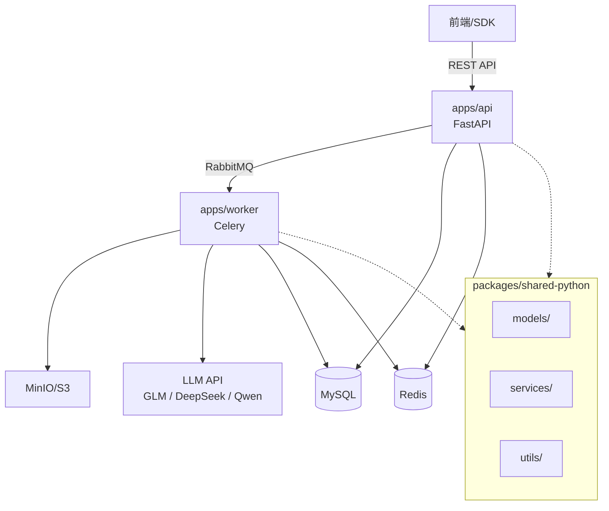
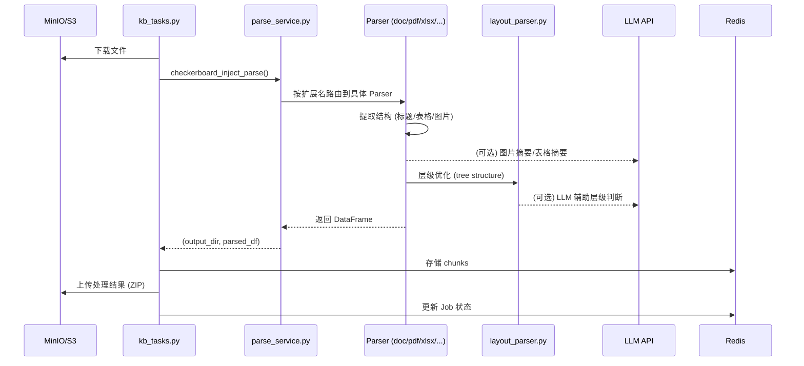

# Knowhere API — Project Tracker

> **Last session**: 2026-03-17 — 停用词集成、ConnectTo 关系构建优化 (长度加权 + 字符去重)、token 过滤增强
> **Current branch**: feat/eric/parsing-update

---

## 0. Session Stats

| 日期 | 时长 | 输入 token (估) | 输出 token (估) | 摘要 |
|------|------|----------------|----------------|------|
| 2026-02-23 | 6m | ~100 | ~4K | 修复 skill 自动触发失败问题，改造 check-skills workflow |
| 2026-02-25 | ~1h 10m | ~3K | ~30K | iLoveAPI 集成、PPTX 解析 pipeline 重构为流式处理 + image-only PDF |
| 2026-02-26 | ~1h 10m | ~5K | ~40K | Table Parser P0 评估（HTMLHeaderExpander 移植+回滚）、MD 分隔线修复、关键词去重 |
| 2026-02-27 | ~2h | ~8K | ~60K | DOCX 表格内嵌图片提取 + summary prompt 优化 + Agentic Profiler (doc_profiler/fast path pymupdf4llm/ppt_converted) + 表格 summary fallback |
| 2026-03-02 | ~1h 20m | ~5K | ~40K | Excel 子表碎片合并 + 隐藏 Sheet 参数化 + _src_row 行号保留 + postprocess_tb index collision fix |
| 2026-03-10 | ~1h | ~3K | ~25K | GLM 集成: 统一 LLM 路由 (glm/qwen/deepseek) + `_get_vision_client()` 消除 4 处硬编码 + MinerU key 修复 |
| 2026-03-17 | ~4h | ~15K | ~120K | 分词管线简化 + Schema 统一 + TOC field 检测修复 + 停用词集成 (百度词表 frozenset) + ConnectTo 优化 (长度加权评分 + SequenceMatcher 字符去重 + 单字符 token 过滤) |

---

## 1. Architecture Overview

### Tech Stack

| 维度 | 说明 |
|------|------|
| **构型** | pnpm workspace + Turborepo monorepo |
| **语言** | Python (FastAPI / Celery) + TypeScript (Next.js) |
| **基础设施** | MySQL · Redis · RabbitMQ · MinIO (S3) |
| **部署** | Docker Compose (dev) / Aliyun & AWS (prod) |

### Directory Structure

```
knowhere/
├── apps/
│   ├── api/             # FastAPI 后端 (port 5005)
│   ├── worker/          # Celery 异步 Worker
│   ├── web/             # Next.js 前端 (port 3000)
│   └── docs/            # 文档站 (port 3001)
├── packages/
│   ├── shared-python/   # Python 共享包 (models, services, utils)
│   ├── sdk-python/      # Python SDK
│   ├── sdk-typescript/  # TypeScript SDK
│   ├── shared-types/    # 共享类型定义
│   └── openapi-specs/   # OpenAPI 规范
├── deploy/              # 部署配置 (aliyun, aws, docker, local-dev)
├── turbo.json           # Turborepo 配置
└── pnpm-workspace.yaml
```

### System Architecture



**API 层** (`apps/api/`): FastAPI 入口、路由 (`jobs`, `knowledge_base`, `billing`, `webhook`, `api_key`, `s3_events`)、Job 状态机、计费 (Stripe)

**Worker 层** (`apps/worker/`): Celery 消费 RabbitMQ — `upload_url_file_task` (URL→S3) + `parse_task` (解析+向量化)

**共享包** (`packages/shared-python/`): ORM 模型、AI/Redis/S3/Webhook 服务、工具函数

---

## 2. Data Flow

### 文档解析主流程



### 解析器路由

| 扩展名 | 解析器 | 说明 |
|--------|--------|------|
| `.pdf` | `pdf_parser.py` → `parse_pdfs()` | PDF 解析 (支持 precision mode) |
| `.docx` | `doc_parser.py` → `parse_docx()` | DOCX，提取标题层级、表格、图片 |
| `.xlsx` | `table_parser.py` → `parse_xlsx()` | Excel，精准合并单元格和 MultiIndex 表头 |
| `.pptx` | `pptx_parser.py` → `parse_pptx()` | PPTX → iLoveAPI PDF → image-only PDF → MinerU VLM |
| `.md` | `md_parser.py` → `parse_md()` | Markdown，BFS 标题优化 |
| `.txt` | `txt_parser.py` → `parse_texts()` | 纯文本 → MD 方式解析 |
| `.png/.jpg` | `image_parser.py` → `parse_image()` | 图片 OCR + LLM 摘要 |

### ORM 核心表

| 模型 | 说明 |
|------|------|
| `Job` | 任务 (状态机驱动) |
| `JobResult` | 任务结果 |
| `KnowledgeBase` | 知识库 |
| `User` / `UserBalance` | 用户 + 余额 (Stripe) |
| `ApiKey` | API 密钥 |
| `CreditsTransaction` / `PaymentRecord` | 计费记录 |
| `Webhook` / `WebhookLog` | Webhook 系统 |

---

## 3. Task Board

### 🔴 In Progress

- [/] **KG Edge chunk_id + SKILL.md 优化** — graph_builder edge 补 source_id/target_id; SKILL.md 重写为 3 层结构引导 (completed: 2026-03-18)

### 🟡 TODO

#### High Priority

- [ ] **KG Bottom-Up File Summary (Phase 1)** — 从 chunk `metadata.summary` 向上聚合为 `files[x].top_summary`
  - 底层数据源: `extract_summary_keywords()` 已为每个 chunk 生成 summary（文本/表格/Excel 4 条路径）
  - Prompt 设计借鉴 FinMemory Insight 的"识别"模式: 不只压缩，还提取 `key_findings`（关键结论/数据/判断）
  - 输出: `{summary: "一句话主题", key_findings: ["发现1", "发现2"]}`
  - 成本: 每文件 1 次 LLM 调用，build_knowledge_graph 时执行

- [ ] **KG Cross-Doc Edge Insight (Phase 2)** — 对高分 edges 生成跨文件洞察，存入 `edge.insight`
  - 输入: 两端文件的 `top_summary` + `top_connections` chunk 名
  - 输出: `edge.insight` + `edge.relation_type` (supplements/extends/contradicts/same_topic) + `edge.insight_confidence`
  - 目标: "这两个文件联合起来能得到什么新发现"
  - 成本: 仅对 top-N 高分 edges 做 LLM 调用

- [ ] **ConnectTo Embedding 语义相似度** — hybrid scoring: `0.5 x keyword_score + 0.5 x cosine_sim`，用 Qwen/ALI embedding API
- [ ] **ConnectTo LLM Predicate 分类** — 参考 FinMemory `extraction_prompt_template` 模式，对 candidate pairs 做 LLM classify:
  - Typed predicates: `extends` / `same_data` / `contains` / `contradicts` / `supplements` / `supersedes`
  - Mem0 式 consolidation: 矛盾信号共存 (conflict_group)，不强制消解
  - `classify_relation()` stub 已在 builder.py 中

- [/] 继续优化**Agentic Profiler** — PDF 智能分类与路由引擎 → 详见 [AGENTIC_PROFILER_SPEC.md](./AGENTIC_PROFILER_SPEC.md)
  - [ ] profile metadata 写入解析结果
  - [ ] 端到端验证 — 不同 PDF 类型 (扫描件/电子版/PPT转换) 路由准确性测试

- [ ] **Excel 子表公式依赖合并 (Phase 2)** — 通过解析公式引用（SUM/AVERAGE 等）构建 cell 依赖图，将汇总行/计算区域自动归属到其数据来源所在的子表

- [ ] **PDF 表格中带图的恢复 Phase 2** — 详见 [PDF_TABLE_IMAGE_PLAN.md](./PDF_TABLE_IMAGE_PLAN.md)
  - 方案 D: PyMuPDF 坐标提取 — MinerU 解析后用 PyMuPDF 补回表格内图片（⚠️ 仅适用于电子版 PDF，扫描件无效）
  - 方案 C: MinerU 交叉对比（备选）

- [ ] **DOCX TOC 利用** — `doc_parser.py:474` 需将检测到的 TOC 数据传入层级（`eval_toc_levels`）辅助 heading 推断
- [ ] **LLM 层级判断** — `layout_parser.py:552` 使用 LLM 基于窗口数据分配 heading level
- [ ] **LaTeX 支持** — `doc_parser.py:489` 处理 LaTeX 等格式
- [ ] **table_parser 已知问题** — `table_parser.py:863` 当前实现有问题 (见 docstring)
- [ ] **智能分块** — `txt_parser.py:124` 当前粗略分割，需更智能策略
- [ ] **OCR 分支** — `toc_parser.py:609` 实现 OCR → 直接生成 toc-tree

#### Normal Priority — TOC Field Depth Tracking

- [ ] **TOC field depth tracking** — `toc_parser.py:detect_doc_tocs` + `doc_parser.py:iter_block_items`
  - 现状：用 boolean `toc_field_active` 跟踪 TOC 域，已修复 PAGEREF 误触发问题
  - 风险：field 域存在嵌套（PAGEREF 内嵌在 TOC 域中），当前无深度计数，嵌套 field 的 `fldChar end` 可能提前 reset `toc_field_active`
  - 当前靠 `is_style`（toc style）兜底，绝大多数 Word 文档安全；但纯field 标记（无 toc style）的TOC理论上会误判
  - 优化：维护 `field_depth` 计数器，`fldChar begin` 时 +1、`fldChar end` 时 -1，仅在 TOC 层 depth 归零时 reset `toc_field_active`

- [ ] **表格 TOC** — `toc_parser.py:151` 提取表格内容但保持 id span 为 1

### ✅ Done

- [x] ~~PPTX 公式渲染~~ — iLoveAPI + image-only PDF 管线，解决 MinerU 公式识别为 `????` 的问题 (completed: 2026-02-25)
- [x] ~~DOCX 表格内嵌图片提取~~ — iter_block_items 按 (row,col) 提取单元格图片，table2html 嵌入描述，handle_table 保存+LLM摘要 (completed: 2026-02-27)
- [x] ~~Summary Prompt 优化~~ — 全局 summary 提示词增加 HTML 表格处理指令 + null 返回值校验 (completed: 2026-02-27)
- [x] ~~表格 Summary Fallback~~ — 图片为主表格 LLM 返回 HTML 时用 table_idx 回退 + prompt 增加拒绝原样返回指令 (completed: 2026-02-27)
- [x] ~~PDF Fast Path (pymupdf4llm)~~ — doc_profiler 识别单栏电子版 PDF → pymupdf4llm 提取，跳过 MinerU；含 ppt_converted 检测路由至 standard (completed: 2026-02-27)
- [x] ~~关键词跨行列去重~~ — doc_parser + md_parser 首行首列合并时消除重复 (completed: 2026-02-26)
- [x] ~~Excel 子表碎片合并 Phase 1~~ — `_merge_small_subtables(min_cells=4)` 吸收碎片 + `include_hidden_sheets` 参数 + `_src_row` 原始行号列 + `postprocess_tb` index collision fix (completed: 2026-03-02)
- [x] ~~分词管线简化~~ — `tokenize2stw_remove` 去除 `merge_non_chinese_until_chinese`，直接用 jieba + 有意义 token 过滤，修复英文 token 拼接问题 (completed: 2026-03-17)
- [x] ~~Schema 统一 (extra→connectto)~~ — 5 个 parser 统一使用 `settings.ALL_DF_COLS.split(',')`，消除所有内联 fallback；部署配置补齐 `page_nums` 列 (completed: 2026-03-17)
- [x] ~~TOC field 检测修复~~ — `detect_doc_tocs` 修复两个 bug：`PAGEREF _TocXXXX` 中 `toc` 子串误触发 `is_field_start` + `is_field_end` 被 `is_style` 守卫跳过导致 field 永不关闭 (completed: 2026-03-17)
- [x] ~~ConnectTo 关系构建 Phase 1~~ — 双模块架构完成 (completed: 2026-03-17)
  - **builder.py**: 倒排索引 + 长度加权评分 `score = Σlen(shared_kw) / min(Σlen(A), Σlen(B))` + SequenceMatcher 字符去重(≥0.8) + 配置: `min_overlap=3, threshold=0.8, cross_file_only=True`，1459→22 高质量 pair
  - **graph_builder.py**: chunk→file 聚合、TF-IDF top_keywords、`importance = 0.7×usage_heat + 0.3×freshness`(指数衰减 half_life=30d)、增量匹配 `_incremental_connections`
  - **chunks_redis_service.py**: `safe_split_kws` 单字符关键词过滤 (len≤1)

### 📋 Code-Level TODOs

| 文件 | 行号 | 注释 |
|------|------|------|
| `layout_parser.py` | 552 | use llm to assign level based on window data |
| `doc_parser.py` | 474 | temporary remove toc area |
| `doc_parser.py` | 481 | handle cross-page tables |
| `doc_parser.py` | 489 | handle latex, etc. |
| `table_parser.py` | 863 | Current implementation has issues |
| `txt_parser.py` | 124 | rough dividing of contents |
| `toc_parser.py` | 151 | if table extract as lines |
| `toc_parser.py` | 609 | implement OCR branch |
| `api_key_service.py` | 185,189,194 | 实现 Redis 缓存 |
| `credits_service.py` | 450 | Calculate from usage logs |
| `moesif_middleware.py` | 130,135 | 解析 JWT / API Key 获取用户 ID |
| `s3_events.py` | 87 | 实现 OSS 签名验证逻辑 |
| `billing.py` | 92,124,126 | 配置限制、成功率、热门端点 |
| `jobs.py` | 278,703 | 文件名、进度详情 |
| `celery_router.py` | 197 | 简化版本 |

---

## 4. Change Log

| 日期 | 类型 | 描述 | 涉及文件 |
|------|------|------|---------|
| 2026-02-25 | feature | iLoveAPI PPTX→PDF 集成 + image-only PDF 渲染管线 (流式处理，bytes in→bytes out) | `pptx_parser.py`, `parse_service.py`, `ai.py`, `.env` |
| 2026-02-26 | fix | MD 表格分隔线过滤 + 关键词跨行列去重 | `table_parser.py`, `doc_parser.py`, `md_parser.py` |
| 2026-02-26 | feature | HTMLHeaderExpander 类移植到 html_parser.py（备用，未集成到解析流程） | `html_parser.py` |
| 2026-02-27 | feature | DOCX 表格内嵌图片提取：iter_block_items 按单元格提取图片，table2html 嵌入描述，handle_table 分离 summary_table/summary_image | `doc_parser.py`, `html_parser.py` |
| 2026-02-27 | fix | summary prompt 优化：HTML 表格用自然语言总结 + null 返回校验，避免 LLM 原样返回 HTML | `prompt_service.py`, `txt_parser.py` |
| 2026-02-27 | feature | Agentic Profiler: doc_profiler.py 实现 PDF profiling (scan_type/column/ppt_converted/text_density)，pymupdf4llm fast path 替换 markitdown | `doc_profiler.py`, `parse_service.py`, `pdf_parser.py` |
| 2026-02-27 | fix | 表格 summary fallback: 图片为主表格 LLM 返回无效内容时用 table_idx 回退 | `doc_parser.py`, `prompt_service.py` |
| 2026-03-02 | feature | Excel 子表碎片合并: `_merge_small_subtables` + `_count_non_empty_cells` + `include_hidden_sheets` 参数 + `_src_row` 行号列 | `table_parser.py` |
| 2026-03-02 | fix | `postprocess_tb` bug fixes: dropna RangeIndex→Int64Index 导致假 index 列 + `reset_index` 列名撞名崩溃 | `table_parser.py` |
| 2026-03-10 | feature | GLM 集成: `_resolve_api_config` 加 glm 路由分支 (async+sync)，`_get_vision_client()` 按 IMAGE_MODEL 名自动路由，消除 4 处硬编码 ALI_API_KEY | `OpenAICompatibleClient.py`, `OpenAICompatibleClientSync.py`, `image_parser.py`, `doc_parser.py`, `ai.py`, `.env` |
| 2026-03-10 | fix | MinerU API key 字段名: `MINERU_API_KEY` → `MINERU_API_KEYS` (匹配 config) + `debug_parse.py` await 移除 (sync 函数) | `.env`, `debug_parse.py` |
| 2026-03-17 | fix | 分词简化: `tokenize2stw_remove` 去除 `merge_non_chinese_until_chinese`，jieba 直出 + `_is_meaningful_token` 过滤 | `text_utils.py` |
| 2026-03-17 | refactor | Schema 统一: 5 个 parser 消除 `ALL_DF_COLS` 内联 fallback，统一 `extra`→`connectto`；部署配置补齐 `page_nums` | `md_parser.py`, `table_parser.py`, `image_parser.py`, `atlas_parser.py`, `ai.py`, `configmap.yaml`, `env.template` |
| 2026-03-17 | fix | TOC field 检测: `detect_doc_tocs` 修复 `PAGEREF _Toc` 子串误触发 + `is_field_end` 始终检测 | `toc_parser.py` |
| 2026-03-17 | feature | 百度停用词集成: `stopwords.py` frozenset (1395词) + `tokenize2stw_remove` 三模式 (None/[]/custom) | `stopwords.py`, `text_utils.py`, `parse_service.py` |
| 2026-03-17 | feature | Token 单字符过滤: `_is_meaningful_token` 过滤 len==1 tokens (数字+汉字+字母) | `text_utils.py` |
| 2026-03-17 | feature | ConnectTo 长度加权评分: `_compute_keyword_score` 改为字符长度加权 `sum(len(kw))` | `builder.py` |
| 2026-03-17 | feature | ConnectTo 字符去重: SequenceMatcher ratio≥0.8 过滤近重复 pair，1459→22 高质量关系 | `builder.py` |

---

## 5. Quick Reference

### Dev Commands

```bash
pnpm dev:services    # 启动基础设施 (MySQL, Redis, RabbitMQ, MinIO)
pnpm dev:api         # 启动 API (FastAPI, port 5005)
pnpm dev:worker      # 启动 Worker (Celery)
pnpm dev:web         # 启动前端 (Next.js, port 3000)
pnpm generate:types  # 类型生成

# 测试
cd apps/api && pytest
cd apps/worker && pytest
cd packages/shared-python && pytest
```

### Worker 调试脚本

| 脚本 | 用途 |
|------|------|
| `debug_parse.py` | 文档解析调试 |
| `debug_toc_prompt.py` | TOC 提示词调试 |
| `debug_toc_detection.py` | TOC 检测调试 |
| `debug_bfs_refine.py` | BFS 标题优化调试 |
| `test_precision_mode.py` | Precision Mode 表头检测测试 |
| `test_parser_comparison.py` | 解析器对比测试 |

### Key Config Files

| 文件 | 说明 |
|------|------|
| `apps/api/.env` | API 环境变量 (含 ILOVEAPI_* 配置) |
| `apps/worker/.env` | Worker 环境变量 (含 ILOVEAPI_* 配置) |
| `packages/shared-python/shared/core/config/` | Python 配置类 (AIConfig) |
| `deploy/docker-compose.prod.yml` | 生产 Docker Compose |
| `deploy/local-dev/` | 本地开发 Docker Compose |

### Quick Locate Guide

| 需求场景 | 入口文件 |
|----------|---------|
| 添加新 API 端点 | `apps/api/app/api/v1/routes/` |
| 支持新文件格式 | `apps/worker/app/services/document_parser/parse_service.py` |
| 修改表格解析 | `table_parser.py` |
| 修改文档结构/标题检测 | `layout_parser.py` |
| 修改 DOCX 解析 | `doc_parser.py` |
| 修改 PDF 解析 | `pdf_parser.py` |
| 修改 PPTX 解析 | `pptx_parser.py` |
| 修改数据库表 | `packages/shared-python/shared/models/database/` + `alembic/` |
| 修改 AI 逻辑 | `packages/shared-python/shared/services/ai/` |
| 修改 Redis 逻辑 | `packages/shared-python/shared/services/redis/` |
| 修改 Job 状态机 | `apps/api/app/services/state_machine/` |
| 修改计费逻辑 | `shared/services/billing/` + `apps/api/app/services/billing/` |
| 调试文档解析 | `apps/worker/debug_parse.py` |

### Branch Strategy

| 分支 | 用途 |
|------|------|
| `staging` | 预发布环境 |
| `feat/eric/parsing-update` | 当前工作分支 — 文档解析优化 |
