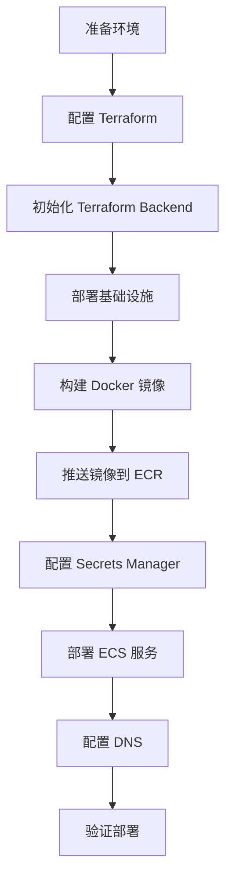

# AWS 部署指南

本文档提供在 AWS 平台部署 Knowhere 项目的完整指南。

## 📋 目录

- [架构概述](#架构概述)
- [前置要求](#前置要求)
- [部署流程](#部署流程)
- [镜像构建](#镜像构建)
- [基础设施部署](#基础设施部署)
- [应用部署](#应用部署)
- [环境配置](#环境配置)
- [监控和日志](#监控和日志)
- [故障排查](#故障排查)

## 架构概述

### 架构图

```
Internet
    ↓
Route 53 (DNS)
    ↓
Application Load Balancer (ALB)
    ↓
┌─────────────────┬─────────────────┬─────────────────┐
│   Frontend      │   Backend       │   Worker        │
│   (Next.js)     │   (FastAPI)     │   (Celery)      │
│   ECS Fargate   │   ECS Fargate   │   ECS Fargate   │
└─────────────────┴─────────────────┴─────────────────┘
    ↓                     ↓                     ↓
    └─────────┬───────────┴─────────────────────┘
              ↓
    ┌─────────────────────────┐
    │   RDS Serverless v2      │
    │   ElastiCache Serverless │
    │   S3 Storage             │
    │   Amazon MQ (RabbitMQ)   │
    └─────────────────────────┘
```

### 核心组件

- **计算**: ECS Fargate（无服务器容器）
- **数据库**: RDS Serverless v2 (Aurora PostgreSQL)
- **缓存**: ElastiCache Serverless (Redis)
- **消息队列**: Amazon MQ for RabbitMQ
- **存储**: S3（对象存储）
- **负载均衡**: Application Load Balancer (ALB)
- **DNS**: Route53
- **密钥管理**: AWS Secrets Manager

## 前置要求

### 1. AWS 账户和权限

- AWS 账户
- 具有以下权限的 IAM 用户或角色：
  - ECS Full Access
  - EC2 Full Access
  - RDS Full Access
  - ElastiCache Full Access
  - S3 Full Access
  - IAM Full Access
  - Route53 Full Access
  - ACM Full Access
  - Secrets Manager Full Access
  - ECR Full Access

### 2. 本地工具

- AWS CLI v2
- Terraform >= 1.0
- Docker
- Git
- jq (JSON 处理工具)

### 3. 域名

- 一个已注册的域名
- 域名在 Route53 中托管（或可以配置 NS 记录）

## 部署流程

### 完整部署流程



### 快速开始

```bash
# 1. 克隆项目
git clone <your-repo-url>
cd knowhere

# 2. 配置 AWS 凭证
aws configure

# 3. 进入部署目录
cd deploy/aws/terraform

# 4. 按照后续步骤完成部署
```

## 镜像构建

### 构建方式

AWS 平台使用**本地构建**方式，通过脚本构建 Docker 镜像并推送到 ECR。

### 构建脚本

位置：`deploy/aws/scripts/build-and-push.sh`

### 构建步骤

1. **设置环境变量**:
   ```bash
   export AWS_ACCOUNT_ID=$(aws sts get-caller-identity --query Account --output text)
   export AWS_REGION=us-east-1
   export ENVIRONMENT=dev  # dev/test/prod
   ```

2. **构建并推送镜像**:
   ```bash
   cd deploy/aws/scripts
   ./build-and-push.sh
   ```

   脚本会自动：
   - 构建三个镜像（backend、frontend、worker）
   - 从 Git Tag 获取版本号
   - 推送到 ECR
   - 打标签（`{environment}-latest`, `{version}`）

3. **验证镜像**:
   ```bash
   # 查看 ECR 中的镜像
   aws ecr list-images --repository-name knowhere-backend --region us-east-1
   ```

### 镜像标签策略

- `{environment}-latest`: 环境最新版本（如 `dev-latest`）
- `{version}`: 版本标签（如 `v1.0.0`）
- `{environment}-{commit-hash}`: 环境+提交哈希（如 `dev-abc1234`）

### 版本号获取

脚本会自动从 Git 获取版本号：
- 如果有精确匹配的 Tag → 使用 Tag（如 `v1.0.0`）
- 如果有 Tag 但不是精确匹配 → 使用 Tag+commit hash（如 `v1.0.0-abc1234`）
- 如果没有 Tag → 使用 `环境名-commit hash`（如 `dev-abc1234`）

## 基础设施部署

### Terraform 配置

#### 1. 初始化配置文件

```bash
cd deploy/aws/terraform

# 复制配置模板
cp terraform.tfvars.example terraform.tfvars.dev
cp backend-config.dev.example backend-config.dev

# 编辑配置文件，填入实际值
vim terraform.tfvars.dev
```

#### 2. 配置变量

编辑 `terraform.tfvars.dev`，设置以下变量：

```hcl
aws_region = "us-east-1"
project_name = "knowhere"
environment = "dev"
domain_name = "knowhereto.ai"
db_password = "your-secure-password"
mq_password = "your-rabbitmq-password"
```

详细变量说明请参考：[AWS Terraform 配置指南](aws/terraform/README.md)

#### 3. 初始化 Backend

首次部署前，需要创建 Backend 资源（S3 + DynamoDB）：

```bash
cd deploy/aws/terraform/scripts
./init-backend.sh dev
```

脚本会自动创建：
- S3 Bucket: `knowhere-terraform-state-dev`
- DynamoDB Table: `knowhere-terraform-locks-dev`

#### 4. 初始化 Terraform

```bash
cd deploy/aws/terraform
terraform init -backend-config=backend-config.dev
```

#### 5. 规划部署

```bash
terraform plan \
  -var-file=terraform.tfvars.dev \
  -var="app_version=$(git describe --tags --exact-match HEAD 2>/dev/null || echo 'dev-$(git rev-parse --short HEAD)')"
```

#### 6. 应用配置

```bash
terraform apply \
  -var-file=terraform.tfvars.dev \
  -var="app_version=$(git describe --tags --exact-match HEAD 2>/dev/null || echo 'dev-$(git rev-parse --short HEAD)')"
```

### 创建的资源

Terraform 会自动创建以下资源：

- **网络**:
  - VPC 和子网（公有/私有）
  - 安全组
  - Internet Gateway
  - NAT Gateway

- **计算**:
  - ECS 集群
  - ECS 任务定义（backend、frontend、worker）
  - ECS 服务

- **数据库**:
  - RDS Serverless v2 (Aurora PostgreSQL)
  - ElastiCache Serverless (Redis)

- **消息队列**:
  - Amazon MQ for RabbitMQ

- **存储**:
  - S3 存储桶
  - EFS 文件系统（模型缓存）

- **网络服务**:
  - Application Load Balancer (ALB)
  - Route53 记录
  - ACM SSL 证书

- **监控**:
  - CloudWatch 日志组
  - CloudWatch Container Insights

## 应用部署

### 1. 配置 Secrets Manager

所有敏感信息存储在 AWS Secrets Manager 中。

#### 初始化 Secrets

```bash
cd deploy/aws/scripts
export ENVIRONMENT=dev
export AWS_REGION=us-east-1
./init-secrets.sh
```

脚本会检查所有必需的 secrets 是否存在。

#### 必需的 Secrets

| Secret 名称 | 说明 | 是否自动创建 |
|-----------|------|------------|
| `knowhere/{environment}/database-url` | 数据库连接 URL | ✅ 是 |
| `knowhere/{environment}/redis-host` | Redis 主机 | ✅ 是 |
| `knowhere/{environment}/redis-port` | Redis 端口 | ✅ 是 |
| `knowhere/{environment}/redis-password` | Redis 密码 | ✅ 是 |
| `knowhere/{environment}/rabbitmq-host` | RabbitMQ 主机 | ✅ 是 |
| `knowhere/{environment}/rabbitmq-username` | RabbitMQ 用户名 | ✅ 是 |
| `knowhere/{environment}/rabbitmq-password` | RabbitMQ 密码 | ✅ 是 |
| `knowhere/{environment}/s3-access-key` | S3 访问密钥 ID | ❌ 需手动设置 |
| `knowhere/{environment}/s3-secret-key` | S3 秘密访问密钥 | ❌ 需手动设置 |
| `knowhere/{environment}/secret-key` | 应用 JWT 密钥 | ❌ 需手动设置 |
| `knowhere/{environment}/stripe-secret-key` | Stripe 密钥（可选） | ❌ 需手动设置 |

#### 手动设置 Secrets

```bash
# 设置 S3 访问密钥
aws secretsmanager update-secret \
  --secret-id "knowhere/dev/s3-access-key" \
  --secret-string "your-access-key-id" \
  --region us-east-1

# 设置应用密钥
aws secretsmanager update-secret \
  --secret-id "knowhere/dev/secret-key" \
  --secret-string "your-jwt-secret-key" \
  --region us-east-1
```

### 2. 部署 ECS 服务

#### 使用部署脚本（推荐）

```bash
cd deploy/aws/scripts
export ENVIRONMENT=dev
export AWS_ACCOUNT_ID=$(aws sts get-caller-identity --query Account --output text)
export AWS_REGION=us-east-1
./deploy.sh all
```

脚本会自动：
- 创建 ECS 任务定义
- 创建 ECS 服务
- 等待服务稳定

#### 手动部署

```bash
# 创建任务定义
aws ecs register-task-definition \
  --cli-input-json file://ecs-task-definition-backend.json

# 创建服务
aws ecs create-service \
  --cli-input-json file://ecs-service-backend.json
```

### 3. 配置 DNS

Terraform 会自动创建 Route53 记录，但需要确保域名在 Route53 中托管。

```bash
# 获取 ALB DNS 名称
cd deploy/aws/terraform
terraform output alb_dns_name

# 验证 DNS 记录
dig apidev.knowhereto.com
```

### 4. 配置 S3 事件通知

Terraform 会自动配置 S3 事件通知到 SNS Topic，并订阅到 API webhook endpoint。

验证配置：

```bash
# 查看 SNS Topic
aws sns list-topics | grep knowhere

# 查看订阅
aws sns list-subscriptions-by-topic --topic-arn <topic-arn>
```

## 环境配置

### 多环境支持

项目支持三个环境：`dev`、`test`、`prod`

每个环境使用独立的：
- 配置文件（`terraform.tfvars.{environment}`）
- Terraform State（S3 Backend）
- 资源（ECS 集群、RDS、S3 等）
- 域名和证书

### 环境差异

| 配置项 | dev | test | prod |
|--------|-----|------|------|
| ECS 服务实例数 | 1 | 1 | 2 |
| RDS 实例数 | 1 | 1 | 2 (高可用) |
| RabbitMQ 模式 | 单实例 | 单实例 | 多 AZ 高可用 |
| 日志保留 | 7 天 | 7 天 | 30 天 |
| 删除保护 | 关闭 | 关闭 | 开启 |

详细环境配置请参考：[AWS Terraform 配置指南](aws/terraform/README.md)

## 监控和日志

### CloudWatch 日志

- **后端日志**: `/ecs/knowhere-{environment}-backend`
- **前端日志**: `/ecs/knowhere-{environment}-frontend`
- **Worker 日志**: `/ecs/knowhere-{environment}-worker`

查看日志：

```bash
# 查看日志流
aws logs describe-log-streams \
  --log-group-name /ecs/knowhere-dev-backend \
  --region us-east-1

# 查看日志事件
aws logs get-log-events \
  --log-group-name /ecs/knowhere-dev-backend \
  --log-stream-name <stream-name> \
  --region us-east-1
```

### CloudWatch Container Insights

已启用 Container Insights，可以监控：
- CPU 和内存使用率
- 网络流量
- 任务状态

### 健康检查

- **后端**: `https://apidev.knowhereto.com/health`
- **前端**: `https://dev.knowhereto.com/`
- **版本信息**: `https://apidev.knowhereto.com/v1/version`

## 故障排查

### 常见问题

#### 1. 服务无法启动

**检查步骤**:
1. 查看 ECS 任务日志
   ```bash
   aws logs tail /ecs/knowhere-dev-backend --follow
   ```

2. 检查任务定义
   ```bash
   aws ecs describe-task-definition \
     --task-definition knowhere-backend-dev
   ```

3. 验证环境变量和 Secrets
   ```bash
   aws ecs describe-task-definition \
     --task-definition knowhere-backend-dev \
     --query 'taskDefinition.containerDefinitions[0].environment'
   ```

4. 检查安全组配置
   ```bash
   aws ec2 describe-security-groups \
     --filters "Name=group-name,Values=knowhere-*"
   ```

#### 2. 数据库连接失败

**检查步骤**:
1. 检查 RDS 安全组是否允许 ECS 访问
2. 验证数据库密码是否正确
3. 确认子网配置（ECS 和 RDS 在同一 VPC）
4. 检查 RDS 状态
   ```bash
   aws rds describe-db-instances \
     --db-instance-identifier knowhere-dev-db
   ```

#### 3. 镜像拉取失败

**检查步骤**:
1. 检查 ECR 权限
   ```bash
   aws ecr describe-repositories
   ```

2. 验证镜像标签
   ```bash
   aws ecr list-images \
     --repository-name knowhere-backend \
     --region us-east-1
   ```

3. 检查 ECS 任务执行角色权限

#### 4. Secrets Manager 访问失败

**检查步骤**:
1. 验证 IAM 角色权限
   ```bash
   aws iam get-role-policy \
     --role-name knowhere-ecs-task-execution-role-dev \
     --policy-name SecretsManagerAccess
   ```

2. 检查 Secret 是否存在
   ```bash
   aws secretsmanager describe-secret \
     --secret-id knowhere/dev/database-url
   ```

3. 验证 KMS 权限（如果使用加密）

#### 5. ALB 健康检查失败

**检查步骤**:
1. 检查目标组健康状态
   ```bash
   aws elbv2 describe-target-health \
     --target-group-arn <target-group-arn>
   ```

2. 验证安全组规则（允许 ALB 访问 ECS）
3. 检查应用健康检查端点是否正常

### 调试命令

```bash
# 查看 ECS 服务状态
aws ecs describe-services \
  --cluster knowhere-cluster-dev \
  --services knowhere-backend-service-dev

# 查看任务状态
aws ecs list-tasks \
  --cluster knowhere-cluster-dev \
  --service-name knowhere-backend-service-dev

# 进入容器调试（需要启用 ECS Exec）
aws ecs execute-command \
  --cluster knowhere-cluster-dev \
  --task <task-arn> \
  --container knowhere-backend \
  --interactive \
  --command "/bin/bash"
```

## 相关文档

- [主部署指南](README.md)
- [AWS Terraform 配置指南](aws/terraform/README.md)
- [AWS Worker 部署指南](aws/WORKER_DEPLOYMENT_GUIDE.md)
- [域名配置说明](DOMAIN_CONFIG.md)

---

**最后更新**: 2024-01-01  
**维护者**: DevOps Team

