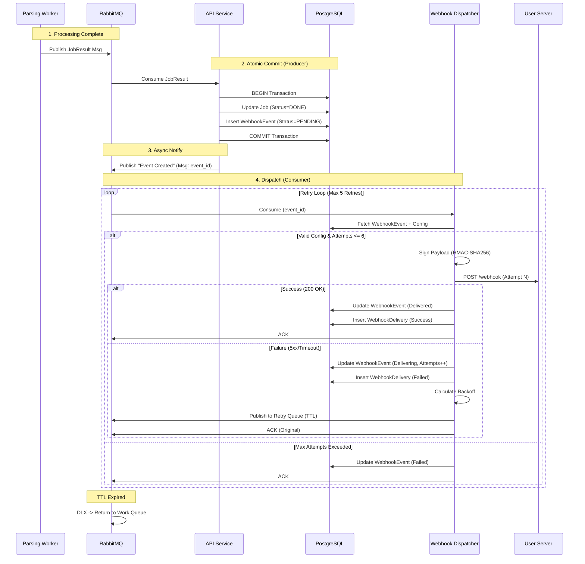

# **Architectural Design Specification: Knowhere API Webhook Delivery System**

## **1. Executive Summary**

This logic specification outlines the design and implementation strategy for the webhook delivery system of the Knowhere API. The system adopts an **Event-Driven Architecture (EDA)** using the **Transactional Outbox Pattern** to ensure **at-least-once delivery**, **reliability**, and **scalability**.

## **2. Requirements Analysis**

### **2.1. Functional Requirements**

| Requirement ID | Description | Source | Implementation Implication |
| :--- | :--- | :--- | :--- |
| **FR-01** | **Event Trigger** | Design 5.2.1 | The system must detect when a job enters a terminal state (done or failed) and trigger a notification event. |
| **FR-02** | **Dynamic Configuration** | Design 5.2 | Webhook URLs and secrets are defined *per request*. Dispatcher loads configuration dynamically from job metadata. |
| **FR-03** | **Retry with Jitter** | Design 5.2.1 | 5 retries (6 total attempts), exponential backoff with ±10% Jitter. Total window approx. 8.5 hours. |
| **FR-04** | **Delivery Semantics** | Design 5.2.1 | "At-Least-Once" delivery. The system continues to retry until the limit is reached or a 2xx response is received. |
| **FR-05** | **Idempotency** | Design 5.2.2 | Payloads include `job_id`. Headers include unique `X-Knowhere-Attempt-ID` (UUIDv4) for every request. |
| **FR-06** | **Security** | Design 5.2.3 | Requests must include `X-Knowhere-Signature` (HMAC-SHA256 of payload with secret). |
| **FR-07** | **Developer Documentation** | Design 5.2.1 | API documentation must clearly inform developers about at-least-once delivery and duplicate message handling. |
| **FR-08** | **SDK Integration** | Design 5.2.3 | Knowhere SDK must provide signature verification utility for developers to validate incoming webhooks. |

### **2.2. Non-Functional Requirements (NFRs)**

| Requirement ID | Type | Description |
| :--- | :--- | :--- |
| **NFR-01** | **Reliability** | The system must not lose events. If the message broker crashes or the worker fails, the event must persist. This necessitates durable storage (Postgres) and durable queues (RabbitMQ). |
| **NFR-02** | **Security** | The system must prevent malicious actors from forging notifications. This requires a cryptographic signature system using the `webhook.secret` provided by the user. |
| **NFR-03** | **Resilience** | Transient failures (e.g., a user's server returning 503) must not cause message loss. An exponential backoff strategy is required to retry requests over a reasonable window (e.g., hours). |
| **NFR-04** | **Scalability** | The dispatching mechanism must be decoupled from the core parsing logic. A backlog of undelivered webhooks must not degrade the performance of the document parsing workers. |

## **3. System Architecture**

The system strictly separates the **Producer** (Parsing Engine) from the **Consumer** (Webhook Dispatcher).

### **2.1. Transactional Outbox Pattern**
To prevent data inconsistency (Dual Write problem), we atomically commit the "Job Done" state and the "Webhook Event" to the database.

**Location**: `apps/api/app/services/messaging/message_handlers.py` (Consumer of JobResult)



### **2.2. Message Broker Topology (Leveled Retries)**
We use RabbitMQ Dead Letter Exchanges (DLX) to implement non-blocking exponential backoff.

-   **Exchanges**:
    -   `webhook.direct`: Primary routing.
    -   `webhook.retry`: Routes to wait queues.
    -   `webhook.dlx`: Routes expired wait messages back to `webhook.direct`.
-   **Queues**:
    -   `q.webhook.work`: Active consumers.
    -   `q.webhook.wait.1m` (TTL: 60s)
    -   `q.webhook.wait.10m` (TTL: 600s)
    -   `q.webhook.wait.30m` (TTL: 1800s)
    -   `q.webhook.wait.2h` (TTL: 7200s)
    -   `q.webhook.wait.6h` (TTL: 21600s)
    -   `q.webhook.dead`: Final failure destination.
### **3.3. Dispatcher Workflow (Consumer)**

The Dispatcher (`apps/worker/app/services/webhook/dispatcher.py`) executes the following logic for each message consumed from `q.webhook.work`:

1.  **Fetch Event**: Load `WebhookEvent` from DB using the ID in the message.
    -   If status is already `delivered` or `failed` (terminal), ACK and exit (Idempotency).
2.  **Prepare Request**:
    -   Generate `X-Knowhere-Attempt-ID` (UUIDv4).
    -   Calculate `X-Knowhere-Signature` = `HMAC-SHA256(secret, payload_bytes)`.
    -   Check `attempts` count. If > 5 (Start + 5 retries = 6 total), mark `failed` and ACK.
3.  **Execute HTTP Request**:
    -   Send POST to `target_url` with timeout (e.g., 10s).
    -   Calculate duration.
4.  **Handle Success (2xx)**:
    -   Update `WebhookEvent`: status=`delivered`.
    -   Insert `WebhookDelivery`: status_code=200, etc.
    -   ACK message.
5.  **Handle Failure (Non-2xx / Network Error)**:
    -   Update `WebhookEvent`: status=`delivering`, attempts++.
    -   Insert `WebhookDelivery`: record error details.
    -   **Retry Logic**:
        -   Calculate backoff (e.g., 60s * 2^attempts + Jitter).
        -   Publish to `webhook.retry` exchange with routing key corresponding to the nearest wait queue (e.g., `wait.1m`).
        -   ACK original message (it is now safely in the wait queue).
## **4. Database Schema**

We will implement these models in `packages/shared-python/shared/models/database/webhook.py`.

### **3.1. WebhookEvent (The Outbox)**
Represents the *intent* to trigger a webhook.

```python
class WebhookEvent(Base):
    __tablename__ = "webhook_events"

    id: Mapped[str] = mapped_column(String(36), primary_key=True, default=lambda: str(uuid4()))
    job_id: Mapped[str] = mapped_column(String(36), ForeignKey("jobs.job_id", ondelete="CASCADE"), nullable=False)
    
    # Snapshot of config at creation time
    target_url: Mapped[str] = mapped_column(String(2048), nullable=False)
    secret: Mapped[str] = mapped_column(Text, nullable=False) 
    
    # Payload (Job Result Snapshot)
    payload: Mapped[Dict[str, Any]] = mapped_column(JSON, nullable=False)
    
    # Status: pending, delivering, delivered, failed, canceled
    status: Mapped[str] = mapped_column(String(50), default="pending", index=True)
    
    # Retry Logic
    attempts: Mapped[int] = mapped_column(Integer, default=0)
    next_retry_at: Mapped[Optional[datetime]] = mapped_column(DateTime, nullable=True)
    
    created_at: Mapped[datetime] = mapped_column(DateTime, default=datetime.utcnow, nullable=False)
    updated_at: Mapped[datetime] = mapped_column(DateTime, default=datetime.utcnow, onupdate=datetime.utcnow, nullable=False)

    # Relationships
    job: Mapped["Job"] = relationship("Job")
    deliveries: Mapped[list["WebhookDelivery"]] = relationship("WebhookDelivery", back_populates="event", cascade="all, delete-orphan")
```

### **3.2. WebhookDelivery (The History)**
Immutable log of every HTTP request attempt.

```python
class WebhookDelivery(Base):
    __tablename__ = "webhook_deliveries"

    id: Mapped[str] = mapped_column(String(36), primary_key=True, default=lambda: str(uuid4()))
    event_id: Mapped[str] = mapped_column(String(36), ForeignKey("webhook_events.id", ondelete="CASCADE"), nullable=False)
    
    attempt_number: Mapped[int] = mapped_column(Integer, nullable=False)
    
    # HTTP Response Data
    status_code: Mapped[Optional[int]] = mapped_column(Integer, nullable=True)
    duration_ms: Mapped[int] = mapped_column(Integer, nullable=False)
    response_body: Mapped[Optional[str]] = mapped_column(Text, nullable=True) # Truncated to 1KB
    response_headers: Mapped[Optional[Dict[str, Any]]] = mapped_column(JSON, nullable=True)
    error_message: Mapped[Optional[str]] = mapped_column(Text, nullable=True) # For internal errors (Connection Refused etc)
    
    created_at: Mapped[datetime] = mapped_column(DateTime, default=datetime.utcnow, nullable=False)
    
    event: Mapped["WebhookEvent"] = relationship("WebhookEvent", back_populates="deliveries")
```

## **5. Exception Handling Strategy**

We will extend our `KnowhereException` base class to handle webhook specific errors.
**File**: `packages/shared-python/shared/core/exceptions/webhook_exceptions.py`

```python
from shared.core.exceptions.knowhere_exception import KnowhereException
from shared.core.response.ErrorCode import ErrorCode

class WebhookException(KnowhereException):
    """Base Webhook Exception"""
    pass

class WebhookConfigError(WebhookException):
    """400 - Invalid Configuration"""
    def __init__(self, internal_message: str):
        super().__init__(
            code=ErrorCode.INVALID_ARGUMENT,
            internal_message=internal_message,
            user_message="Invalid webhook configuration.",
            http_status_code=400
        )

class WebhookDeliveryError(WebhookException):
    """500 - Transient Delivery Failure"""
    def __init__(self, internal_message: str, retryable: bool = True):
        super().__init__(
            code=ErrorCode.INTERNAL_ERROR,
            internal_message=internal_message,
            user_message="Webhook delivery failed.",
            http_status_code=500
        )
        self.retryable = retryable
```

## **6. Security & Reliability**

1.  **Signature Verification (HMAC-SHA256)**:
    -   Header: `X-Knowhere-Signature`.
    -   Algorithm: `HMAC-SHA256(secret, payload_bytes)`.
    -   Note: Unlike Stripe, the original design doc specifies signing the *raw body* directly, not a constructed string with timestamp. We will stick to the provided requirement: "HMAC-SHA256 calculation on the request body original text".

2.  **Idempotency Headers**:
    -   `X-Knowhere-Attempt-ID`: UUIDv4 unique to each delivery attempt.
    -   Allows users to deduplicate specific retries even if the `job_id` logic failed mid-transaction.

## **7. Implementation Roadmap (Task List)**

This section tracks the step-by-step implementation of the design.

### **Phase 1: Shared Infrastructure**
- [ ] **Data Models**
    - [ ] Create `packages/shared-python/shared/models/database/webhook.py` with `WebhookEvent` and `WebhookDelivery`.
        - [ ] `WebhookEvent`: id, job_id, target_url, secret, payload, status, attempts, next_retry_at.
        - [ ] `WebhookDelivery`: id, event_id, attempt_number, status_code, duration_ms, response_body.
    - [ ] Update `packages/shared-python/shared/models/database/__init__.py` to export new models.
    - [ ] Create Alembic migration in `apps/api` to create tables `webhook_events` and `webhook_deliveries`.
- [ ] **Exceptions**
    - [ ] Create `packages/shared-python/shared/core/exceptions/webhook_exceptions.py`.
        - [ ] `WebhookConfigException` (400).
        - [ ] `WebhookDeliveryException` (500).

### **Phase 2: Producer Logic (API Service)**
- [ ] **Message Handler Update** (`apps/api/app/services/messaging/message_handlers.py`)
    - [ ] Update `_handle_result_async` function:
        - [ ] Construct payload from `JobResult`.
        - [ ] Retrieve webhook config (url, secret) from `JobMetadata`.
        - [ ] Create `WebhookEvent` object (pending).
        - [ ] Add to DB session before commit.
    - [ ] Add post-commit hook or explicit call to publish message:
        - [ ] Routing Key: `webhook.direct`.
        - [ ] Body: `{"event_id": "..."}`.

### **Phase 3: Consumer Logic (Dispatcher)**
- [ ] **Queue Configuration** (`apps/worker/app/core/queue_config.py` or similar)
    - [ ] Define Exchanges: `webhook.direct`, `webhook.retry` (Topic), `webhook.dlx` (Fanout).
    - [ ] Define Queues & Bindings:
        - [ ] `q.webhook.work` -> `webhook.direct` / `webhook.dlx`.
        - [ ] `q.webhook.wait.1m` (TTL 60s) -> `webhook.retry` (key: *.1m).
        - [ ] `q.webhook.wait.10m` (TTL 600s) -> `webhook.retry` (key: *.10m).
        - [ ] (Repeat for 30m, 2h, 6h).
- [ ] **Dispatcher Service** (`apps/worker/app/services/webhook/dispatcher.py`)
    - [ ] Implement `WebhookDispatcher` class.
    - [ ] Method `dispatch(event_id)`:
        - [ ] Logic to check attempts and status.
        - [ ] Logic to generate HMAC-SHA256 signature.
        - [ ] Logic to clean/validate target URL.
        - [ ] Logic to send HTTP request (httpx).
        - [ ] Logic to handle response (200 vs 500).
        - [ ] Logic to calculate next retry and publish to correct wait queue.
- [ ] **Queue Consumer** (`apps/worker/app/main.py`)
    - [ ] Register consumer for `q.webhook.work`.

### **Phase 4: API & Verification**
- [ ] **API Endpoints** (`apps/api/app/api/v1/routes/webhook.py`)
    - [ ] `GET /logs`: Join `WebhookEvent` and `WebhookDelivery`.
- [ ] **Testing**
    - [ ] Unit Test: `WebhookDispatcher.sign_payload` vs known HMAC.
    - [ ] Unit Test: `WebhookDispatcher.calculate_backoff` logic.
    - [ ] Integration Test: Full flow from `_handle_result_async` to Mock Server receiving POST.

### **Phase 5: Documentation & SDK** *(Not Planned)*

> [!NOTE]
> The following tasks are not included in the current implementation plan.

- [ ] ~~**API Documentation Update**~~
- [ ] ~~**SDK Integration**~~
