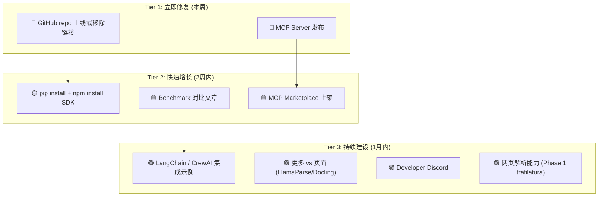

# Knowhere 修正版战略分析 — 基于已发布产品

> 日期: 2026-03-23 | 基于 [knowhereto.ai](https://knowhereto.ai/) 实际产品的修正分析  
> 前版见: [初版战略分析](file:///Users/wuchengke/.gemini/antigravity/brain/b7831f64-d3e9-4da2-a0ef-835086a64672/knowhere_strategy_analysis.md)

---

## 1. 产品现状（修正后）

之前我的分析低估了产品完成度，以下是修正后的实际状态：

```
技术完成度: ████████░░ 80%  (解析管线 + KG + Agentic Profiler)
产品完成度: ███████░░░ 70%  ← 修正! (API 上线 + 文档站 + Dashboard + Stripe 计费)
市场验证:   █░░░░░░░░░ 10%  (产品已发布但尚无规模用户)
```

### 已上线的能力

| 模块 | 状态 | URL |
|------|------|-----|
| **REST API** | ✅ 上线 | `api.knowhereto.ai` |
| **文档站** | ✅ 上线 | [docs.knowhereto.ai](https://docs.knowhereto.ai/) |
| **Dashboard** | ✅ 上线 | knowhereto.ai/login |
| **Stripe 计费** | ✅ 上线 | 按页计费，3 个月过期 |
| **Landing Page** | ✅ 上线 | 有对比页、Demo、集成指南 |
| **OpenClaw 插件** | ✅ 上线 | `@ontos-ai/knowhere-claw` (npm + ClawHub) |
| **GitHub 开源** | ❌ **404** | `github.com/Ontos-AI/knowhere-api` 返回 404 |
| **MCP Server** | ❌ 待做 | — |
| **Python SDK (pypi)** | ❓ 待确认 | 文档有 Python 示例但未见 `pip install knowhere` |

> [!WARNING]
> **最大问题**：Landing page 上有 [GitHub](https://github.com/Ontos-AI/knowhere-api) 链接，但访问**返回 404**。对开发者来说这是严重的信任问题。需要立即决定：公开 repo 或移除链接。

---

## 2. Crawl4AI 反爬快速回顾

Crawl4AI 不自研反爬，而是组合集成：

| 层级 | 实现 | 开源？ |
|------|------|--------|
| Stealth Mode | `playwright-stealth` | ✅ 开源库 |
| Undetected Browser | 深层 Chromium 补丁 | ✅ 自研 |
| Magic Mode | 行为模拟引擎 | ✅ 自研 |
| Cloudflare 绕过 | CapSolver (第三方付费 CAPTCHA) | ❌ 付费服务 |

**结论**：如果 Knowhere 做网页解析，采用相同组合策略即可，不需要自研反爬引擎。

---

## 3. 当前真正的增长瓶颈

产品已经上线，问题不是"做不做"而是"怎么被发现"。

### 瓶颈诊断

| 问题 | 严重性 | 说明 |
|------|--------|------|
| **GitHub 404** | 🔴 | 开发者工具最重要的信任来源是 GitHub。链接挂了 = 不存在 |
| **无 MCP Server** | 🔴 | 2026 年 Agent 的标准调用方式是 MCP，没有 MCP = 被 Agent 框架忽略 |
| **无 pip/npm SDK** | 🟡 | 文档有代码示例，但开发者期望 `pip install knowhere-sdk` |
| **对比页只有 Unstructured** | 🟡 | 缺少 vs LlamaParse、vs Docling 等更有热度的对标 |
| **无公开 Benchmark** | 🟡 | "我们更好"需要数据证明——同文档解析质量对比 |
| **无社区入口** | 🟡 | 无 Discord/Slack channel，developer 无法问问题 |

---

## 4. 修正后的优先级排序

基于产品已上线的事实，策略从"先做产品"变成"先获客"：



---

## 5. MCP Server — 第一增长杠杆

### 为什么 MCP 现在比什么都重要

| 数据点 | 来源 |
|-------|------|
| 75% API 网关厂商将在 2026 年集成 MCP | Gartner 2025 |
| 40% 企业应用将内嵌 AI Agent | Gartner 2025 |
| OpenAI Agents SDK 基于 MCP 构建 | OpenAI 2025.03 |
| MCP Marketplaces 正在爆发 (Smithery, AgentPatch, mcpmarket.com) | 行业观察 |

### Knowhere MCP Server 的价值

```python
# Agent 调用 Knowhere 只需：
mcp_client.use_tool("knowhere_parse", {"url": "https://example.com/report.pdf"})
# → 返回结构化 chunks + metadata + KG 关系
```

Agent 开发者不需要学你的 REST API、不需要管认证、不需要处理异步轮询 —— MCP 协议自动处理一切。这将**大幅降低集成摩擦**。

### MCP Server 实现估算

| 工作 | 估时 |
|------|------|
| 基础 MCP server (FastMCP + 2 个 tool: parse_document, get_result) | 4h |
| 发布到 npmjs / pypi | 2h |
| 上架 Smithery + AgentPatch + mcpmarket.com | 2h |
| README + demo GIF | 2h |
| **总计** | ~10h |

---

## 6. 开源策略修正

> [!IMPORTANT]
> 原分析建议开源基础解析引擎，但既然产品已发布且依赖付费 API 模式，改为：**开源接入层（MCP/SDK），核心引擎保持云服务**。

| 开源 | 不开源 |
|------|-------|
| ✅ MCP Server (github.com/Ontos-AI/knowhere-mcp) | ❌ 解析引擎 (所有 parser) |
| ✅ Python SDK (`knowhere-sdk`) | ❌ KG 构建逻辑 |
| ✅ TypeScript SDK | ❌ Agentic Profiler |
| ✅ 集成示例 (LangChain/CrewAI/OpenClaw) | ❌ 网页解析 (如果实现) |

这与 LlamaParse (开源 LlamaIndex，Cloud API 做 parsing) 和 Unstructured.io (开源基础 lib，SaaS 做高级功能) 的路径一致。

---

## 7. 8 周执行计划

| 周 | 行动 | 预期产出 |
|-----|------|---------|
| **W1** | ① GitHub 404 修复 ② MCP Server 开发+发布 | 开发者信任恢复 + Agent 可调用 |
| **W2** | ① pip/npm SDK 发布 ② MCP Marketplace 上架 | 降低集成门槛 |
| **W3-4** | ① Benchmark 文章 (vs LlamaParse/Unstructured/Docling) ② 技术博客 "Why Agent Memory ≠ Chat Memory" | SEO + 技术公信力 |
| **W5-6** | ① LangChain/CrewAI integration example ② Developer Discord 开设 | 社区种子用户 |
| **W7-8** | ① 网页解析 Phase 1 (trafilatura 静态) ② vs 对比页扩展 | 功能面拓宽 |

---

## 8. 定价策略评估

你当前的 **按页计费 + 无复杂 tier** 模式其实很好，符合 2026 年的趋势（60% 新 B2B SaaS 将采用 usage-based pricing）。

### 建议微调

| 维度 | 当前 | 建议 |
|------|------|------|
| **免费额度** | Free Trial | 保持，建议明确标注"每月 X 页免费"以降低注册心理门槛 |
| **价格透明** | "No complex tiers" 但页面上看不到具体单价 | 在 Pricing 区公开 $/page 单价，开发者最讨厌"联系销售才知道价格" |
| **年付折扣** | 无 | 可考虑对 commit 用量提供折扣（如预购 10K 页打 8 折） |
| **免费层引流** | 无 mention | MCP Server / SDK 免费使用（调 API 消耗 credits）→ 自然漏斗 |

### 竞品价格锚点

| 竞品 | 定价 | Knowhere 参照 |
|------|------|-------------|
| LlamaParse | $0.003/page (free 1000/day) | 对标此价格 |
| Unstructured SaaS | 按量 API calls | 类似模式 |
| Mem0 | $19-$249/mo subscription | 不同赛道，但可参考 |
| Azure Document Intelligence | $1.50/1000 pages | 大厂标杆 |

---

## 9. 总结修正

| 维度 | 初版判断 | 修正后判断 |
|------|---------|-----------|
| **产品完成度** | 40% | **70%** — API/文档/计费/OpenClaw 均已上线 |
| **第一步** | "发布 MCP Server + SDK" | **修复 GitHub 404 + MCP Server** — 产品已在，缺的是发现通道 |
| **开源策略** | 开源基础解析引擎 | **开源接入层（MCP/SDK），引擎保持云端** — 与 LlamaParse 策略一致 |
| **核心瓶颈** | "技术没有出口" | **"产品存在但不可被发现"** — GitHub 404 + 无 MCP + 无 pip/npm |
| **网页解析优先级** | 中 | **低** — 先解决获客再扩展能力边界 |

> **一句话**：产品已经比我想象的完整得多。现在的关键不是再造轮子，而是**打通 3 个发现通道**：GitHub（信任）、MCP Marketplace（Agent 生态触达）、pip/npm（开发者习惯）。每个通道各需 1-2 天工作量。
