# Ontology Scanner × .knowhere 融合分析

## 现状：两套独立系统

### Ontology Scanner（发现层）

| 能力 | 说明 |
|------|------|
| **扫描** | 递归扫描 `~/Documents`, `~/Desktop`, `~/Downloads`, iCloud, OneDrive 等 |
| **过滤** | 3级跳过：黑名单目录 + 正则模式 + 结构检测（代码项目/macOS bundle） |
| **评分** | 双层评分：folder score（知识密度+体积+时效）→ file score（文件夹+类型+时效+副本数+体积）|
| **输出** | [ontology.db](file:///Users/wuchengke/Desktop/knowhereapi-main/apps/worker/app/tmp_res/ontology/ontology.db)(SQLite) + `parse_queue.json`(top-100待解析) + `user_profile.json`(领域画像) + `tree.json`(树形结构) |
| **不做** | ❌ 不读文件内容，纯元数据 |

### .knowhere（解析层）

| 能力 | 说明 |
|------|------|
| **解析** | 自研 PDF/DOCX/XLSX/PPTX/Atlas 解析 → chunks + keywords + summary |
| **知识图谱** | [knowledge_graph.json](file:///Users/wuchengke/.knowhere/chengke_kb/knowledge_graph.json): 文件级节点(TF-IDF keywords + importance) + 跨文件边(keyword overlap) |
| **增量** | [build_and_deploy()](file:///Users/wuchengke/Desktop/knowhereapi-main/apps/worker/app/services/connect_builder/graph_builder.py#949-1084): 检测已有 graph → 增量更新 |
| **MCP** | 自动注册 Cursor/Claude MCP server，agent 可直接搜索 |
| **存储** | `~/.knowhere/{kb_id}/{filename}/chunks.json` + parsed assets |

### 核心问题：两者断开

```
Ontology Scanner                    .knowhere
┌──────────────┐                ┌──────────────┐
│ 扫描磁盘      │                │ 解析文件      │
│ 评分排序      │  ── 手动 ──▶   │ 构建图谱      │
│ 输出 queue    │                │ MCP 检索      │
└──────────────┘                └──────────────┘
   parse_queue.json                knowledge_graph.json
   
   问题：没有自动化管线连接两者
```

---

## 融合架构设计

### 目标：Scanner 是 .knowhere 的"眼睛"

```mermaid
graph TD
    S[Ontology Scanner] -->|发现高价值文件| Q[Parse Queue]
    Q -->|自动/手动触发| P[Knowhere Parser]
    P -->|chunks + assets| KH["~/.knowhere/{kb_id}/"]
    KH -->|知识图谱| KG[knowledge_graph.json]
    KG -->|MCP| Agent[AI Agent]
    
    S -->|用户画像| UP[user_profile.json]
    UP -->|领域兴趣| Agent
    
    KH -->|已解析文件列表| S
    S -->|diff: 新文件/变更文件| Q
    
    style S fill:#f9f,stroke:#333
    style KH fill:#9ff,stroke:#333
    style Agent fill:#ff9,stroke:#333
```



### 三个关键融合点

#### 1. Scanner → .knowhere：自动解析管线

Scanner 的 [build_parse_queue()](file:///Users/wuchengke/Desktop/knowhereapi-main/apps/worker/app/services/ontology_scanner/scanner.py#681-861) 输出 top-100 文件，但目前需要手动复制路径到 [debug_parse.py](file:///Users/wuchengke/Desktop/knowhereapi-main/apps/worker/debug_parse.py)。

**融合方案**：新增 `auto_ingest()` 函数

```
scanner.build_parse_queue(limit=100)
    ↓ 过滤已在 .knowhere 中的文件
    ↓ 按 file_score 降序
    ↓ 逐个调用 checkerboard_inject_parse()
    ↓ build_and_deploy() 部署到 ~/.knowhere/{kb_id}/
```

关键设计决策：
- **去重**：对比 [parse_queue](file:///Users/wuchengke/Desktop/knowhereapi-main/apps/worker/app/services/ontology_scanner/scanner.py#1029-1046) 和 `~/.knowhere/{kb_id}/` 已有目录名，跳过已解析的
- **变更检测**：`file_assets.mtime` vs `~/.knowhere` 下的 `scan_time`，mtime 更新 → 重新解析
- **批量限制**：每次最多解析 N 个文件（避免 LLM 成本失控）

#### 2. .knowhere → Scanner：反向同步

Scanner 不知道哪些文件已经被解析过。需要一个**已解析注册表**。

**方案**：在 [ontology.db](file:///Users/wuchengke/Desktop/knowhereapi-main/apps/worker/app/tmp_res/ontology/ontology.db) 的 [file_assets](file:///Users/wuchengke/Desktop/knowhereapi-main/apps/worker/app/services/ontology_scanner/scanner.py#544-561) 表加一列 `knowhere_status`

```sql
ALTER TABLE file_assets ADD COLUMN knowhere_status TEXT DEFAULT NULL;
-- 值: NULL(未解析) / 'parsed' / 'stale'(源文件已更新)
```

[build_and_deploy()](file:///Users/wuchengke/Desktop/knowhereapi-main/apps/worker/app/services/connect_builder/graph_builder.py#949-1084) 成功后回写：`UPDATE file_assets SET knowhere_status='parsed' WHERE path=?`

#### 3. User Profile → Agent Context：领域画像注入

Scanner 的 `user_profile.json` 包含用户兴趣领域（建筑方案、学术论文、财务报表等），这对 agent 的检索策略很有价值。

**方案**：`user_profile.json` 合并进 `~/.knowhere/{kb_id}/meta.json`，MCP server 在初始化时加载，agent 查询时获得领域上下文。

---

## 实施优先级评估

| 编号 | 融合点 | 价值 | 复杂度 | 建议 |
|------|--------|------|--------|------|
| **F1** | Scanner → auto_ingest | ⭐⭐⭐ 核心价值 | 中等（需要异步+限制） | **优先做** |
| **F2** | 去重/变更检测 | ⭐⭐⭐ 防重复解析 | 低（文件名+mtime对比） | **F1 的前置条件** |
| **F3** | User Profile → MCP | ⭐⭐ 增强检索 | 低 | 可后做 |
| **F4** | knowhere_status 回写 | ⭐ 状态同步 | 低 | 可后做 |

### 最小可行融合（MVP）

只做 **F1 + F2**，新增一个函数 `scan_and_ingest()`：

```python
def scan_and_ingest(kb_id: str, max_files: int = 10):
    """Scanner发现 → Knowhere解析 → 部署到~/.knowhere/"""
    # 1. 扫描
    scanner = FileSystemScanner()
    scanner.scan()
    queue = scanner.build_parse_queue(limit=100)
    
    # 2. 过滤已解析
    kb_dir = os.path.expanduser(f"~/.knowhere/{kb_id}")
    existing = set(os.listdir(kb_dir)) if os.path.exists(kb_dir) else set()
    
    pending = []
    for f in queue:
        # 去重：检查文件名（含扩展名）是否已存在于 .knowhere
        basename = os.path.basename(f["path"])
        if basename not in existing:
            pending.append(f)
    
    # 3. 按优先级解析 top-N
    for f in pending[:max_files]:
        result = checkerboard_inject_parse(f["path"], ...)
        build_and_deploy(chunks, kb_id, parsed_output_dir)
```

---

## 远期愿景：流式记忆扩展

当前架构天然支持扩展到流式数据（聊天记录、会议纪要），因为：

1. **Scanner 层**：增加新的 scan source（微信导出、Slack JSON、日历 .ics），只需扩展 `TARGET_EXTENSIONS` 和 `TYPE_GROUPS`
2. **Parser 层**：新增 `chat_parser.py` 处理时间序列对话，输出 chunks 的 schema 和文档一致
3. **KG 层**：[build_and_deploy()](file:///Users/wuchengke/Desktop/knowhereapi-main/apps/worker/app/services/connect_builder/graph_builder.py#949-1084) 不关心 chunks 来源，只要有 `chunk_id` + [content](file:///Users/wuchengke/Desktop/knowhereapi-main/apps/worker/app/services/document_parser/toc_parser.py#143-200) + [keywords](file:///Users/wuchengke/Desktop/knowhereapi-main/apps/worker/app/services/document_parser/table_parser.py#998-1022) + [path](file:///Users/wuchengke/Desktop/knowhereapi-main/apps/worker/app/services/connect_builder/graph_builder.py#695-698) 就能构建图谱

```
文档 → Scanner → Parser → chunks → KG → MCP → Agent
聊天 → Scanner → ChatParser → chunks ─┘
日历 → Scanner → CalParser → chunks ──┘
```
