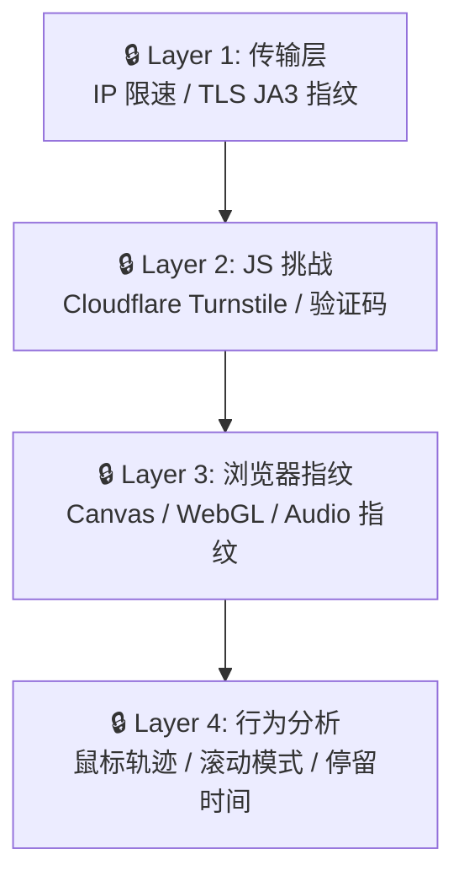
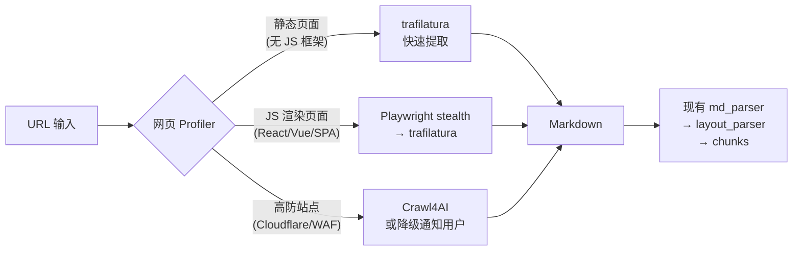
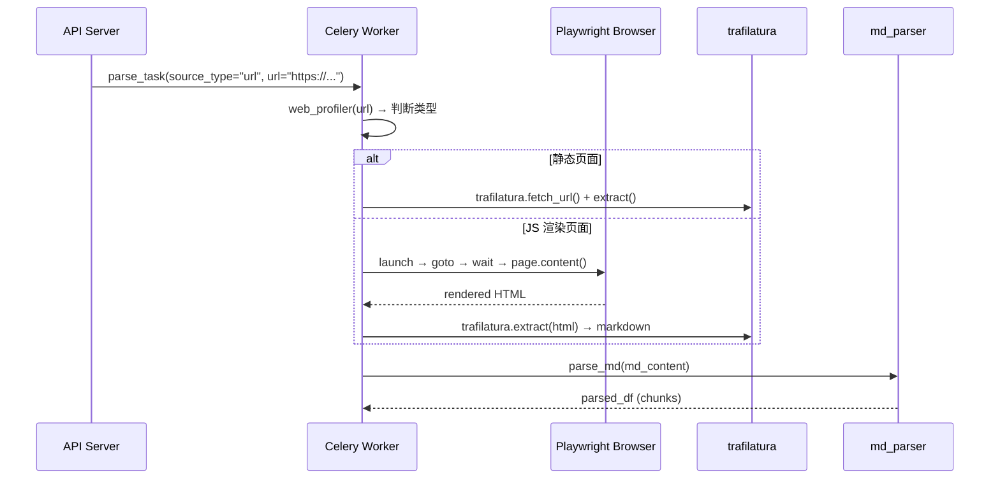

# 网页解析可行性分析 — Knowhere 解析管线 → Web

## 1. 现状评估：现有能力 vs 网页需求

### 现有 [html_parser.py](file:///Users/wuchengke/Desktop/knowhereapi-main/apps/worker/app/services/document_parser/html_parser.py) 不是网页解析器

> [!IMPORTANT]
> [html_parser.py](file:///Users/wuchengke/Desktop/knowhereapi-main/apps/worker/app/services/document_parser/html_parser.py) 是一个 **表格渲染工具**，不是网页解析器。它做的事情是：
> - DOCX Table → HTML（[table2html](file:///Users/wuchengke/Desktop/knowhereapi-main/apps/worker/app/services/document_parser/html_parser.py#437-586)）
> - MultiIndex DataFrame → HTML thead（[render_multiindex_thead](file:///Users/wuchengke/Desktop/knowhereapi-main/apps/worker/app/services/document_parser/html_parser.py#588-703)）
> - HTML table → DataFrame / Markdown（[tb_htmlstr_to_df](file:///Users/wuchengke/Desktop/knowhereapi-main/apps/worker/app/services/document_parser/html_parser.py#323-339), [html_to_md_lines](file:///Users/wuchengke/Desktop/knowhereapi-main/apps/worker/app/services/document_parser/html_parser.py#300-321)）
> - 复杂表头展开（[HTMLHeaderExpander](file:///Users/wuchengke/Desktop/knowhereapi-main/apps/worker/app/services/document_parser/html_parser.py#22-273)）
>
> **没有任何函数**处理 `<div>`, `<article>`, `<nav>`, `<script>` 等网页结构元素。

### 可复用的现有能力

| 现有组件 | 可复用于网页 | 说明 |
|---------|------------|------|
| `md_parser.py` | ✅ 直接复用 | 网页→Markdown 后，接入 md_parser 做层级优化 |
| [layout_parser.py](file:///Users/wuchengke/Desktop/knowhereapi-main/apps/worker/app/services/document_parser/layout_parser.py) | ✅ 直接复用 | BFS 标题优化，对 Markdown 内容通用 |
| `text_utils.py` | ✅ 直接复用 | 分词、关键词提取、停用词过滤 |
| [html_parser.py](file:///Users/wuchengke/Desktop/knowhereapi-main/apps/worker/app/services/document_parser/html_parser.py) | ⚠️ 部分复用 | 网页内含表格时，可用 [HTMLHeaderExpander](file:///Users/wuchengke/Desktop/knowhereapi-main/apps/worker/app/services/document_parser/html_parser.py#22-273) 和 [html_to_md_lines](file:///Users/wuchengke/Desktop/knowhereapi-main/apps/worker/app/services/document_parser/html_parser.py#300-321) |
| `image_parser.py` | ✅ 直接复用 | 网页内图片摘要 |
| `trafilatura` (已安装) | ✅ **开箱即用** | 静态网页正文提取，输出 Markdown/text |
| `markitdown` (已安装) | ⚠️ 备选 | 支持 HTML→Markdown，但主要面向文档 |

> [!TIP]
> **关键 insight**：网页解析可以分解为 **「获取 HTML/DOM → 提取正文 → 转 Markdown → 现有管线」**，你的管线从 Markdown 这一步开始都是现成的。缺的只是前两步。

---

## 2. 核心难题：反爬虫

### 2025-2026 反爬虫现状

现代网站的反爬虫分 **4 层防线**：



| 防线层级 | 静态爬虫（requests） | 普通 headless | Stealth headless |
|---------|-------------------:|-------------:|----------------:|
| L1 传输层 | ❌ 被识别 | ⚠️ JA3 可疑 | ✅ 可伪装 |
| L2 JS 挑战 | ❌ 无法执行 JS | ✅ 可过 | ✅ 可过 |
| L3 浏览器指纹 | ❌ 无 | ❌ webdriver=true 暴露 | ✅ stealth 补丁 |
| L4 行为分析 | ❌ 无行为 | ❌ 无真实行为 | ⚠️ 需模拟 |

### 网页的三种类型

| 类型 | 占比 (估) | JS 渲染 | 反爬 | 示例 |
|------|----------|---------|------|------|
| **静态** | ~30% | 无 | 低 | 博客、文档站、wiki |
| **CSR/SPA** | ~50% | 重度依赖 | 中-高 | 新闻站、电商、SaaS |
| **高防** | ~20% | 重度 + WAF | 极高 | 社交媒体、金融 |

---

## 3. 方案对比

### 方案 A：纯静态提取（trafilatura）

```
URL → requests GET → trafilatura.extract() → Markdown → md_parser → chunks
```

- **优势**: 零新增依赖（trafilatura 2.0.0 已装），速度快（~0.5s/页），无需 headless 浏览器
- **劣势**: 无法处理 JS 渲染页面（SPA/React/Vue），对 Cloudflare 保护的站点直接 403
- **代码量**: ~50 行
- **适用**: 静态博客、文档站、公开 wiki
- **覆盖率**: ~30% 的网页

### 方案 B：Sub-Agent Headless Browser（你的提议 ✅ 推荐）

```
URL → Playwright (stealth) → 等待渲染 → DOM → trafilatura/readability → Markdown → md_parser → chunks
```

- **优势**: 能处理 JS 渲染、能自动滚动/等待、stealth 插件绕过 L1-L3 检测
- **劣势**: 需要安装 Playwright + Chromium (~200MB)、每页 2-5s、Worker 内存占用增加
- **代码量**: ~200 行
- **适用**: 绝大多数网站
- **覆盖率**: ~80% 的网页

### 方案 C：Crawl4AI（整合方案）

```
URL → Crawl4AI(内置 Playwright + stealth + 智能提取) → Markdown (RAG优化) → md_parser → chunks
```

- **优势**: 专为 LLM/RAG 设计，内置 stealth + 智能内容提取 + 媒体提取，输出直接是 clean Markdown
- **劣势**: 额外依赖（但维护活跃，17k+ stars），学习成本
- **代码量**: ~100 行（集成代码更少因为 Crawl4AI 封装了很多）
- **适用**: 绝大多数网站 + 自动提取结构化数据
- **覆盖率**: ~80%

### 方案 D：混合策略（推荐最终形态）



---

## 4. 你的 Sub-Agent 方案深入分析

你提到「做一个 sub-agent 模拟人去开网页然后获取 DOM」，这个直觉是对的。更准确地说：

### 技术实现方式

```python
# 核心思路 (Playwright stealth)
from playwright.async_api import async_playwright

async def fetch_rendered_dom(url: str) -> str:
    async with async_playwright() as p:
        browser = await p.chromium.launch(headless=True)
        context = await browser.new_context(
            user_agent="Mozilla/5.0 ...",  # 真实 UA
            viewport={"width": 1920, "height": 1080},
        )
        page = await context.new_page()
        
        # ---- 反检测 ----
        await page.add_init_script("""
            Object.defineProperty(navigator, 'webdriver', {get: () => false});
        """)
        
        # ---- 模拟人类行为 ----
        await page.goto(url, wait_until="networkidle")
        await page.evaluate("window.scrollTo(0, document.body.scrollHeight)")
        await page.wait_for_timeout(random.randint(500, 1500))
        
        # ---- 获取渲染后 DOM ----
        html = await page.content()
        await browser.close()
        return html
```

### 关键注意点

| 维度 | 说明 |
|------|------|
| **资源消耗** | Chromium 每个实例 ~150-300MB RAM；建议用 browser context 复用 |
| **并发限制** | Worker 机器上建议同时不超过 3 个 browser context |
| **超时处理** | `networkidle` 对某些站点会 hang，需设 `timeout=30000` |
| **Cookie/登录** | 需要考虑是否支持带 cookie 访问（如需登录的内部系统） |
| **Docker 部署** | 生产环境需要 `mcr.microsoft.com/playwright/python` 基础镜像或手动安装 Chromium |

### 与 Knowhere Worker 的集成点



---

## 5. 建议路线图

| 阶段 | 工作内容 | 预估工时 |
|------|---------|---------|
| **Phase 1** | [parse_service.py](file:///Users/wuchengke/Desktop/knowhereapi-main/apps/worker/app/services/document_parser/parse_service.py) 添加 `.html`/URL 路由 + trafilatura 静态提取 | 2-3h |
| **Phase 2** | 集成 Playwright (stealth) 用于 JS 渲染页面 | 4-6h |
| **Phase 3** | 网页 Profiler（HEAD 请求检测 CSR/CF 保护）+ 智能路由 | 3-4h |
| **Phase 4** | 生产加固：Docker Playwright 镜像 + 并发控制 + 超时 + 重试 | 4-6h |

---

## 6. 总结

| 维度 | 结论 |
|------|------|
| **可行性** | ✅ 完全可行，现有管线 Markdown→chunks 全链路可复用 |
| **缺的是什么** | 只缺「URL → rendered HTML → Markdown」这一段前端管道 |
| **你的 sub-agent 直觉** | ✅ 正确，本质就是 Playwright headless 模拟浏览器 |
| **反爬虫应对** | 通过 stealth 插件 + 行为模拟可覆盖 ~80% 站点；高防(Cloudflare AI Labyrinth/Turnstile)需降级或用付费 API |
| **推荐方案** | 混合策略 (方案 D)：静态用 trafilatura → JS渲染用 Playwright → 高防降级 |
| **第一步** | 从 Phase 1 (trafilatura 静态提取) 开始，代码最少、ROI 最高 |
